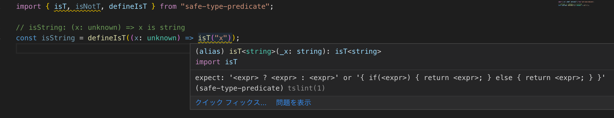

## TL;DR

```ts
import { isT, isNotT, defineIsT } from "safe-type-predicate";

// isA: (x: "a" | "b") => x is "a"
const isA = defineIsT((x: "a" | "b") =>
    x === "a" ? isT(x) : isNotT()
);
```

## GitHub
[safe-type-predicate](https://github.com/kgtkr/safe-type-predicate)  

## type predicate and its dangers

TypeScript has a feature called type predicate.
This is by coding the return value of a function that takes an appropriate type of value `x` and returns` boolean` as `x is T`. If` true` is returned, `x` is of type` T`, `false` This is a function that indicates that it is not.
This feature enables type guarding with user-defined functions.  
For example, an `unknown` type, that is, a function that takes an arbitrary type and returns whether its value is a` string` type is as follows.

```ts
function isString(x: unknown): x is string {
  return typeof x === "string";
}
```

This is a convenient function, but there is a great danger. That is no type checking.
For example, the following code is actually a function that determines whether it is a `number` type, but the type definition is a function that determines whether it is a` string` type.
```ts
function isString(x: unknown): x is string {
  return typeof x === "number";
}
```

Even in such a simple example, type checking is not performed, so a slight mistake is likely to cause a bug.
So this article introduces how to use type predicate safely and `safe-type-predicate`, a library I created to make it happen.

## How to use type predicate safely
To safely handle type predicate is to safely code a function defined as `(x: T) => x is R`.
However, since it is TypeScript, perfect safety is impossible. So the goal is to be able to code safely if you follow a certain coding style.
And in order to realize this, I thought about making good use of type guard and type inference.  

And the idea that it could be realized if the following coding was possible was born.

```ts
const isHoge = defineIsT((x: /* parameter type */) =>
    /* conditional expression */ ? isT(x) : isNotT()
);
```

If you code as above, `x` at the time of` isT (x) `is type guarded by the conditional expression, so type inference is possible.
Also, considering the value (ie the result of compiling to JS), `defineIsT` should be defined as an identity function,` isT` and `isNotT` should be defined as constant functions that return` true` and `false` respectively.
Next, think about type definitions.
The result was the following.

```ts
declare const isTSymbol: unique symbol;
declare const isNotTSymbol: unique symbol;

export type isT<T> = true & { _T: T; _Tag: typeof isTSymbol };
export type IsNotT = false & { _Tag: typeof isNotTSymbol };

export function isT<T>(_x: T): isT<T> {
  return true as isT<T>;
}

export function isNotT(): IsNotT {
  return false as IsNotT;
}

export function defineIsT<T, R extends T>(
  f: (x: T) => isT<R> | IsNotT
): (x: T) => x is R {
  return f as any;
}
```

`IsT <T>` uses new type and phantom type techniques, and `IsNotT` uses new type techniques.
The new type can be converted to the original type, but cannot be converted from the original type without casting.This works without it, but is safer because it prevents you from entering values ​​other than the return value of `isT`,` isNotT`.
.This is the part of & {_Tag: typeof isTSymbol} `and` & {_Tag: typeof isNotTSymbol} `.
Phantom type is a technique that leaves another type of information in the mold.Here, the type information `T` remains in the` & {_T: T} `part.


By using this, it became possible to write as follows.

```ts
// isString: (x: unknown) => x is string
const isString = defineIsT((x: unknown) =>
    typeof x === "string" ? isT(x) : isNotT()
);
```

And what I have written so far is published as a library under the name `safe-type-predicate`.

## Custom tslint rules

Using `safe-type-predicate` allows you to use type predicate more safely than doing nothing.
However, if the following is coded, there will naturally be a contradiction between the type system and operation.

```ts
// isString: (x: unknown) => x is string
const isString = defineIsT((x: unknown) =>
    isT("x")
);
```

This is because it is a library that aims to be safe as long as it follows a certain way of writing.
So we created a tslint rule that enforces a certain way of coding and published it under the name `tslint-safe-type-predicate`.
You can use `npm i -D tslint-safe-type-predicate` and just add` "tslint-safe-type-predicate" to `extends` in `tslint.json`. 
By doing this, for example, in the above example, a warning like the following image is issued.


