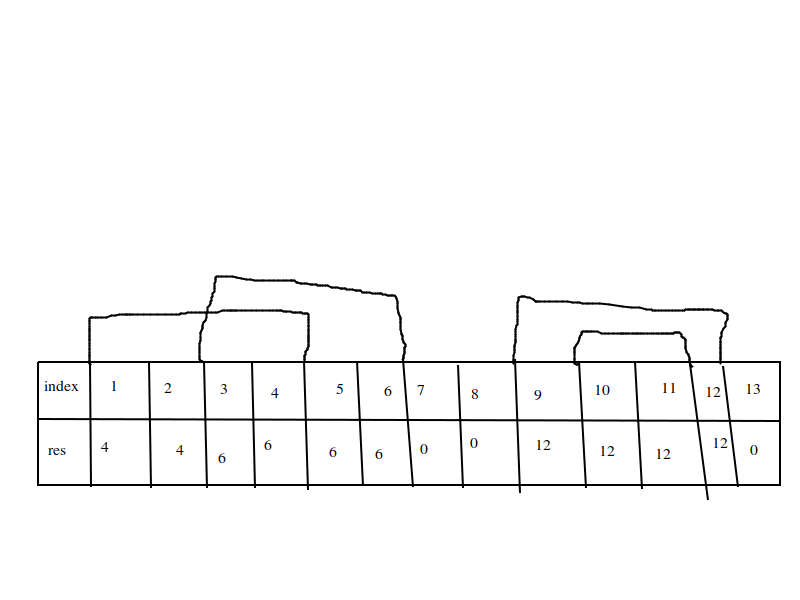

# 問題
https://joi2019-yo.contest.atcoder.jp/tasks/joi2019_yo_e

# 解法
まず{(L,R)}の前処理をします。
サイズNのリストを用意して自分が入っている区間[L,R]のうちRが最大のもので初期化をします。どの区間にも入っていなければ0です。



ただ普通に実装すると`O(MN)`で間に合わないので工夫が必要です。
まず{(L,R)}(以後LRと呼ぶ)をR→Lの優先順位で降順ソートします。
次に用意したリストを右から埋めていく(既に埋めた所は埋めない)をしていくと`O(N)`となり間に合います。
疑似コードは以下のような感じです。

```
let m_list = make_vec(init=0,len=N);
my_sort(LR) // my_sortはLRをR→Lの優先順位で降順ソートする関数

let cur = N;
for (l, r) in LR {
    for i in range(l,min(cur-1, r)) {
        m_list[i] = r;
    }
    cur = min(cur, l);
}
```

これで前処理は終わりです。この前処理したリストをm_listと呼ぶことにします。
次はメインの処理です。
これはi番目以降のツリーの美しさの最大値という一次元DPで実装出来ます。
i番目に置く場合と置かない場合のmaxを取ればいいです。よくあるやつですね。
置く場合はさっき前処理したやつを使います。
iに飾ってしまうと入っている区間の最大のRまでは飾る事が出来ません。よって`max(i,m_list[i])+1`以降しか飾れない事がわかります。(iとのmaxを取っているのはどの区間にも入っていない場合0となるため)
よって以下のような疑似コードとなります。

```
f(i){
    if(i>=len(A)){
        0
    }else{
        max(f(i + 1),A[i] + f(max(i, m_list[i]) + 1))
    }
}
```

あとはこれをメモ化すればおしまいです。


# ソース
解説するよりソース見たほうが早そうなので置いておきます。
https://github.com/kgtkr/procon/blob/master/atcoder/rust/joi2019_yo_e/src/main.rs