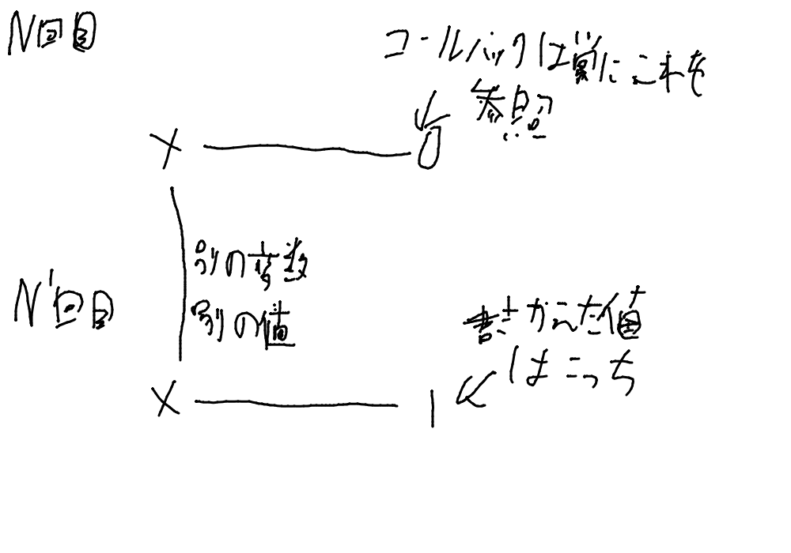
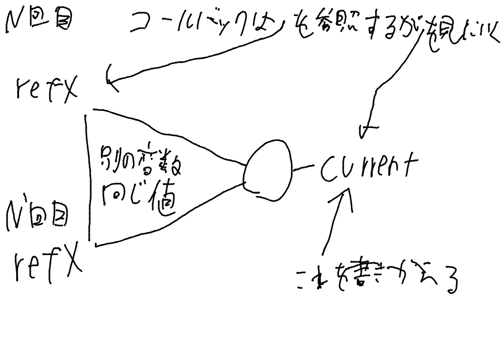

# 初めに
以下のコードはstateの値が変わった時どのような動作をすると思いますか？
本質ではないので`clearInterval`等の処理は省略しています。

```ts
const [x, setX] = useState(0);
useEffect(() => {
  setInterval(() => {
    console.log(x);
  }, 1000);
}, []);
```

このコード、思うようには動かずstateの値が変わってもずっと0が出力され続けます。
何故でしょうか？JSのクロージャをある程度理解している人なら分かると思います。
コンポーネント関数が呼ばれた時の動作を考えてみましょう。
初回呼び出しでは`useState(0)`を呼ぶと`x`に`0`という値が入ります。
`useEffect`のコールバックも呼び出されます。この時`setInterval`のコールバックは`x`という変数をキャプチャしています。
2回目以降の呼び出しでは`x`は現在のstateです(このコードだけでは具体的な値は分からない)
`useEffect`の第二引数が`[]`なのでコールバックは呼び出されません。
つまり`setInterval`のコールバックの`x`は**常に**1回目に呼び出された時の`x`をキャプチャしています。
また`useState`が原因で勘違いしやすい所ですが、N回目の`x`とN'回目の`x`は全く**別の変数**です。Reactがいい感じに管理してくれるので同じ変数のように見えますが、JSから見たら全くの別物です。ここがポイントです。
だから`setInterval`のコールバックがキャプチャしている`x`は常に1回目の呼び出しの値、つまり`0`となってしまうのです。


# 解決策
ではどう解決したらいいでしょうか？
`useRef`と使って以下のように書きます。

```ts
const [x, setX] = useState(0);
const refX = useRef(x);
useEffect(() => {
  refX.current = x;
}, [x]);
useEffect(() => {
  setInterval(() => {
    console.log(refX.current);
  }, 1000);
}, []);
```

なぜこれで上手く行くのでしょうか？
まず2行目〜5行目で`x`の値を`refX.current`に常にいれるようなコードを書いています。
また今回は`setInterval`のコールバックは`x`ではなく`refX`をキャプチャしています。
今回もN回目の呼び出しとN'回目の呼び出しの`refX`が全く別の変数という事に変わりはないのですが、`useRef`が内部でいい感じにしてくれるおかげで、`refX`の値は**常に一定**です。だから全く別の変数であっても問題が起きません。


また`x`の値を`refX`にいれるコードはよく使うのでカスタムフック化しておきましょう。

```ts
export function useValueRef<T>(val: T) {
  const ref = React.useRef(val);
  React.useEffect(() => {
    ref.current = val;
  }, [val]);
  return ref;
}
```

これを使うとこうなります。

```ts
const [x, setX] = useState(0);
const refX = useValueRef(x);
useEffect(() => {
  setInterval(() => {
    console.log(refX.current);
  }, 1000);
}, []);
```

# 場合によってはシンプルになる解決策
さっきはキャプチャする変数を参照にすることで解決しました。
しかし変数が増えると大変です。
そこで今度は関数を参照にしてみましょう。

```ts
const [x, setX] = useState(0);
const f = useValueRef(() => {
  console.log(x);
});
useEffect(() => {
  setInterval(() => {
    f.current();
  }, 1000);
}, []);
```

最初のコード例でも最新の`x`をキャプチャするクロージャは常に生成されていました。
しかし`useEffect`の第二引数が`[]`であったため使われずに捨てられていました。
今回はこれを有効活用することで解決しています。`f.current`は常に最新の`x`をキャプチャしたクロージャです。

`f`という名前が汚染されるとめんどうなので以下のようなカスタムフックを作って綺麗にしましょう。

```ts
export function useEffectRef<T>(effect: (ref: React.MutableRefObject<T>) => void | (() => void | undefined), val: T, deps?: React.DependencyList) {
  const ref = useValueRef(val);
  React.useEffect(() => effect(ref), deps);
}
```

これを使うとこうなります。

```ts

const [x, setX] = useState(0);
useEffectRef(f => {
  setInterval(() => {
    f.current();
  },1000);
}, () => {
  console.log(x);
}, []);
```

これなら変数が増えても楽ですね。
