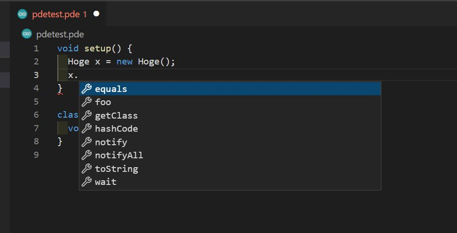

## インストール方法と機能
以下のリンクからインストールしてProcessing4のパスを設定すれば使えます(設定した後に再起動すると自動でLanguage Serverがダウンロードされ、そのあともう一回くらい再起動が必要かもです)
https://marketplace.visualstudio.com/items?itemName=kgtkr.processing-language-server-vscode

機能はエラー報告、補完、フォーマット、シンタックスハイライトです。

## リポジトリ
* https://github.com/kgtkr/processing-language-server
* https://github.com/kgtkr/processing-language-server-vscode

## 作った動機
弊学科の授業では主にProcessingというJavaのような(というかほぼJava)言語が使われています。主にこの言語で課題が出されるのですが、公式のIDEが(VSCodeと比べると)とても使いにくいです(~~あと退屈な課題はCopilotにやらせようをするためにVSCodeを使いたい~~)。VSCodeで編集してコマンドラインから実行することもできるのですが、[VSCodeの拡張](https://marketplace.visualstudio.com/items?itemName=Luke-zhang-04.processing-vscode)は補完やエラー報告機能が使えず、あまり快適ではありません。公式IDEにはシンタックスハイライト、補完、定義へのジャンプ、ドキュメント表示、エラー報告、デバッガ、フォーマッタなど一通りの機能が揃っています。この機能(のとりあえず一部)を、Processingのソース引っ張ってきてlspを喋らせるようにすればVSCodeでも快適に編集できる拡張をそこそこ簡単にできるのではと思い作ることにしました。

## 実装言語、ライブラリなど
ProcessingのコードがJavaで書かれているのでLanguage ServerはScalaで実装することにしました。Scala3で初めて作ったプロジェクトな気がしますが、3の機能は特に使ってないです。またlsp4jというJavaでLSPを実装する用のライブラリがあるので使いました。
VSCode拡張はもちろんTypeScriptです。

## 拡張機能の動作
Processingさえ入っていればjarをダウンロードするだけで(最終的にはVSCode拡張から自動でダウンロードするようにしました)動かせるようにしたかったのでProcessingに同梱されているJREを使います。4だとJava11なのでJava11でコンパイルしないとclassファイルのバージョンの問題で動きません。Processingのコードは `getProtectionDomain` を使ってjreの場所を取得して、そこからの相対パスで設定ファイルなどを読み込んでいるコードが結構あるので、Processingのコードごとfat jarにして配布すると動きません。`sbt-assembly` の `assemblyExcludedJars` でProcessingのコードだけ除外したjarを作って実行時にクラスパスを通すことで上手く行くのでそうします。
またLanguage Serverは標準入出力でやり取りできますが、標準出力に突然何かが出力されて落ちるなどしてデバッグがつらかったのでTCP Socketでやりとりするようにしました(Unix SocketでもいいですがWindowsでめんどくさそうだったので)。

## Processingのコードについて
この記事のProcessingのコードは4.0b2のものです(GPLで配布されています)。
* https://github.com/processing/processing4/tree/processing-1277-4.0b2

## Processingのコードリーディング
Processing4のBetaがリリースされたので4を対象に作ることにしました。3も対応出来たらしようと思ったのですが、ソースコード構成が大幅に変わっていてめんどくさそうだったのでやめました。

まずは非GUIアプリということで、コマンドラインからProcessingを使う `processing-java` というコマンドのコードを読んでみます。Linuxでは `processing-java` 自体はシェルスクリプトで書かれています。このシェルスクリプトを読むとProcessingのインストールディレクトリにある、 `lib/*.jar`, `core/library/*.jar`, `modes/java/mode/*.jar` をクラスパスに追加し、 `java/bin/java` にあるjreを使って `processing.mode.java.Commander` クラスを実行していることが分かります。このあたりはOSによって微妙にパスが違いますがそれ以外は同じです。

## インストールを簡単にしよう
* 簡単にインストールできること
* マルチプラットフォームで動くこと

## 制限
Processing4のみサポート
Processing.jsやProcessing.pyは使えない

## 今後
安定化
ホバーでドキュメント表示
定義にジャンプ
