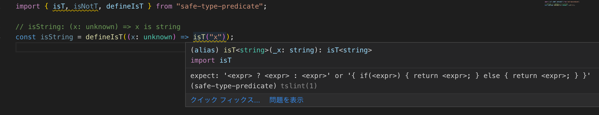

## TL;DR

```ts
import { isT, isNotT, defineIsT } from "safe-type-predicate";

// isA: (x: "a" | "b") => x is "a"
const isA = defineIsT((x: "a" | "b") =>
    x === "a" ? isT(x) : isNotT()
);
```

## GitHub
[safe-type-predicate](https://github.com/kgtkr/safe-type-predicate)  

## type predicateとその問題点

TypeScriptにはtype predicateという機能が存在する。  
これは適当な型の値`x`を受け取り`boolean`を返す関数の戻り値を`x is T`と書くことで､`true`を返せば`x`が`T`型､`false`を返せばそうでないことを表す機能である。 
これによってユーザー定義関数で型ガードを行うことを可能にしている。  
例えば`unknown`型、つまり任意の型を受け取りその値が`string`型であるかを返す関数は次のようになる。

```ts
function isString(x: unknown): x is string {
  return typeof x === "string";
}
```

これは便利な機能であるが大きな問題が存在する。それは型チェックがほとんど効かないことである。  
例えば以下のコードは実際は`number`型であるかを判定する関数なのに、型上では`string`型であるかを判定する関数になってしまっている。

```ts
function isString(x: unknown): x is string {
  return typeof x === "number";
}
```

この程度の単純な例でも型チェックが行われないためちょっとしたミスがバグの原因になりやすい。  
そこでこの記事ではtype predicateを安全に使う方法と、それをライブラリ化した`safe-type-predicate`を紹介する。

## type predicateを安全に使う方法
type predicateを安全に扱うとはつまり`(x: T) => x is R`な関数を安全に定義することである。  
もちろんTypeScriptなので完全な安全は難しい。そこで一定の書き方に従っている限り安全であることを目指すことにした。
そしてこれを実現するために、型ガードと型推論を上手く生かす事を考えた。  

そして以下のような書き方ができれば良いという発想になった。  

```ts
const isHoge = defineIsT((x: /* 引数に取る型 */) =>
    /* 条件式 */ ? isT(x) : isNotT()
);
```

このように書ければ条件式のおかげで`isT(x)`の時点の`x`は型ガードによって絞り込まれているので型推論可能である。  
また値を考えると(つまりJSへのコンパイル結果)、`defineIsT`は恒等関数、`isT`と`isNotT`はそれぞれ`true`と`false`を返す定数関数とすればよくシンプルである。  
あとは上手く型をつけるだけである。  

それで出来たものが以下である。

```ts
declare const isTSymbol: unique symbol;
declare const isNotTSymbol: unique symbol;

export type isT<T> = true & { _T: T; _Tag: typeof isTSymbol };
export type IsNotT = false & { _Tag: typeof isNotTSymbol };

export function isT<T>(_x: T): isT<T> {
  return true as isT<T>;
}

export function isNotT(): IsNotT {
  return false as IsNotT;
}

export function defineIsT<T, R extends T>(
  f: (x: T) => isT<R> | IsNotT
): (x: T) => x is R {
  return f as any;
}
```

`IsT<T>`はnew typeと幽霊型のテクニックを、`IsNotT`はnew typeのテクニックを使っている。
new typeは元の型には変換出来るが、元の型からはキャストなしでは変換出来ない型である。これはなくても動作するが、あったほうが`isT`, `isNotT`の戻り値以外の値が入ることを防止出来るのでより安全である。ここでは`& { _Tag: typeof isTSymbol }`と`& { _Tag: typeof isNotTSymbol }`の部分である。  
幽霊型は型に別の型の情報を残すテクニックである。ここでは`& { _T: T }`の部分で`T`という型情報を残している。  

これを使うことで以下のように書くことが出来るようになった。 

```ts
// isString: (x: unknown) => x is string
const isString = defineIsT((x: unknown) =>
    typeof x === "string" ? isT(x) : isNotT()
);
```

そしてここまで書いた事は`safe-type-predicate`という名前でライブラリ化して公開している。


## カスタムtslintルール

`safe-type-predicate`を使う事で何もしないよりはかなり安全にtype predicateを使うことが出来るようになった。  
しかし以下のような書き方をされれば当然型システムと動作に矛盾が生じる。  

```ts
// isString: (x: unknown) => x is string
const isString = defineIsT((x: unknown) =>
    isT("x")
);
```

なぜなら「一定の書き方に従っている限り安全」ということを目指して作ったライブラリだからだ。
そこで「一定の書き方」を強制させればよいのではないかと考えtslintルールを作り、`tslint-safe-type-predicate`という名前で公開した。  
`npm i -D tslint-safe-type-predicate`して、`tslint.json`の`extends`に`"tslint-safe-type-predicate"`を追加するだけで使える。    
こうすることで例えば上の例では以下の画像のような警告を出してくれる。  


