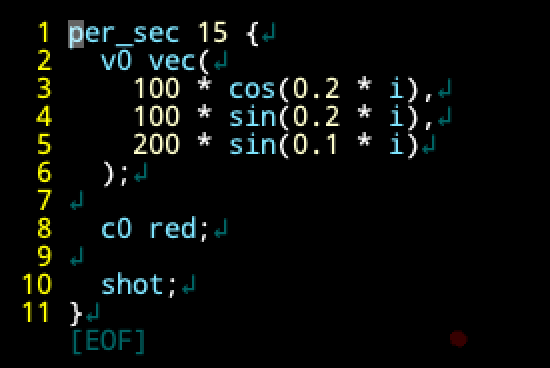
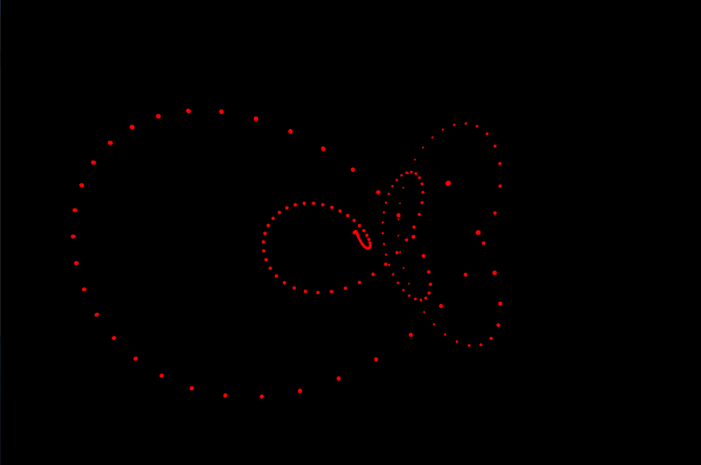

## 対象読者
明大FMSのEP演習という授業で発表した内容の補足資料なので、同大の同級生を対象読者に基本的なところから解説しています。言語実装をしたことある人にとっては知っている話が多いかと思います。

## ソースコード
* https://github.com/kgtkr/BarrageLCL

ドキュメントもここにあります。今回は[d8d1412](https://github.com/kgtkr/BarrageLCL/tree/d8d1412715ecda5b5d7809b0f182f9790dd0bb17)をベースに解説していきます。

## BarrageLCLの概要
Processing製の3D弾幕生成ライブコーディング言語です。実行環境だけでなく、編集環境も用意されています。自作言語×自作エディタですね。

以下のコードを見てください。


このコードは毎秒15回、初速度を `(100cos(0.2i), 100sin(0.2i), 200sin(0.1i))` に、色を赤に設定して弾を発射するというコードです。`i` は何回目の実行かを表す変数です。  
すると以下のように弾が発射されます。



### なぜこれを？
EP演習第一回のオープニングパフォーマンスで見たライブコーディング言語が面白かったことと、夏休みのEP演習で3D空間で球を表示すると綺麗であることに気づいたので、これらを組み合わせて何か作ろうとなり作ってみました。


## 言語本体の解説
言語実装に必要な処理は以下の4つです。

1. 字句解析
2. 構文解析
3. 静的チェック
4. 評価

処理は以上ですが、トークンや構文木のデータの定義も行う必要があります。

### トークンの定義
トークンとはソースコードを分解した時の最小単位です。例えば以下のコードを考えます。

```
cos(count)
```

このコードは、 `["cos", "(", "count", ")"]` と分解できます。この分解された1つ1つがトークン(=字句)です。

[Token.pde](https://github.com/kgtkr/BarrageLCL/blob/d8d1412715ecda5b5d7809b0f182f9790dd0bb17/Token.pde)でトークンを定義をしています。定義は以下です。

```java
enum TokenKind {
  Op,
  OpenParent,
  CloseParent,
  Ident,
  // 略
}

class Token {
  final TokenKind kind;
  final int begin;
  final int end;
  final String value;
  // 略
}
```

トークンは、トークンの種類、ソースコード上の位置、文字列を持っています。トークンの種類は `Op`(演算子)、`OpenParent`(開き丸括弧)、`Ident`(識別子)などがあります。識別子とは変数名や関数などの名前のことを指します。上の `cos(count)` という例だと `cos` や `count` が識別子です。なぜソースコード上の位置が必要かというと、ユーザーが間違ったコードを実行しようとした時に「コードのここが間違っているよ」と場所を教えて上げる必要があるからです。

### 字句解析
字句解析とはソースコード(文字列)を受け取ってトークンのリストに分解する処理です。例えば以下のような変換をします。

```
"cos(0.2 * i)"
↓ 字句解析
["cos", "(", "0.2", "*", "i", ")"]
```

単純な字句解析器は、空白、改行やコメントといったプログラムの意味に無関係の要素はここで取り除いてしまい、また無効な文字が現れるとその場でエラーにします。ただし、今回は字句解析の結果を編集環境のハイライト(数字、コメントなど種類ごとに色分けしてソースコードを分かりやすく表示する機能)で使いたいので、「コメント」「無効な文字」といったトークンの種類を用意して一旦字句解析を行います(これによって字句解析は必ずソースコードの終端まで行われます)。その後無効な文字がないかのチェックをして、コメントなどを取り除きます。

今回は正規表現を使って字句解析をしています。正規表現とは文字列とマッチするパターンを記述する言語です。例えば `^[a-z][a-z0-9]*$` というパターンは、英小文字が最初に来て、その後に英小文字または数字が0文字以上続く事を表します(`^` は先頭、`$` は終端です)。これは `a` や `a12` 、`a1b` にはマッチしますが、`A` や `12a` にはマッチしません。

[Lexer.pde](https://github.com/kgtkr/BarrageLCL/blob/d8d1412715ecda5b5d7809b0f182f9790dd0bb17/Lexer.pde)が字句解析のコードです。

まず `TokenPattern` という正規表現とトークンの種類のペアを定義しています。

```java
class TokenPattern {
  final Pattern pattern;
  final TokenKind kind;
  // 略
}
```

これの値をトークンの種類分用意します。それが `tokenPatterns` です。

```java
final TokenPattern[] tokenPatterns = {
  new TokenPattern(Pattern.compile("^[a-zA-Z_][a-zA-Z0-9_]*"), TokenKind.Ident),
  new TokenPattern(Pattern.compile("^[0-9]+(\\.[0-9]+)?"), TokenKind.FloatLiteral), 
  // 中略
  new TokenPattern(Pattern.compile("^."), TokenKind.InvalidChar), 
};
```

これは、 `^[a-zA-Z_][a-zA-Z0-9_]*` というパターンにマッチした時はこれを `Ident` とするといったことを表しています。最後に `^.` という任意の1文字にマッチするパターンがあり、これを `InvalidChar` (無効な文字) としているので必ずどれかにマッチします。

`Lexer` が字句解析をするクラスです。

```java
class Lexer {
  final String src;
  int pos;
  // 中略
}
```

`src` は入力された文字列、 `pos` は次に解析する位置です。このクラスには `parseToken` という1つ字句解析を進めるメソッドと `parseTokens` という最後まで字句解析を行うメソッドがあります。

まず `parseToken` です。

```java
Token parseToken() {
  for (TokenPattern tokenPattern : tokenPatterns) {
    int begin = this.pos;
    // matchPattern はパターンにマッチしたらposを進めてマッチした文字列を返す。マッチしなければnullを返すメソッド
    String value = this.matchPattern(tokenPattern.pattern);
    if (value != null) {
      int end = this.pos;
      return new Token(tokenPattern.kind, begin, end, value);
    }
  }

  throw new RuntimeException("unreachable");
}
```

これは `tokenPatterns` の先頭からマッチするかを順番に試していって、最初にマッチしたものをトークンとして返しています。どれかには必ずマッチするのでマッチするものがない時は到達不能(unreachable)例外を投げています。

次に `parseTokens` です。

```java
List<Token> parseTokens() {
  List<Token> tokens = new ArrayList();
  while (this.pos < this.src.length()) {
    tokens.add(this.parseToken());
  }

  return tokens;
}
```

これは終端に到達するまで、 `parseToken` を繰り返しています。


他にも `validTokens` という関数があります。これは　`parseTokens` ではスペースやコメントを取り除いたり、エラーのチェックはしないので `parseTokens` のあとに呼び出して意味のないトークンを取り除いたり、無効な文字が含まれていないかをチェックする関数です。

```
code = "a + b"
↓ tokens = new Lexer(code).parseTokens()
tokens = ["a", " ", "+", " ", "b"]
↓ vTokens = validTokens(tokens)
vTokens = ["a", "+", "b"]
```


### 構文木の定義
構文木とはプログラムを木構造で表したものです。プログラムの文法は以下のように再帰的な定義になります。

```
式 とは 関数呼び出し or ... or ... である
関数呼び出し とは 識別子(式, 式,... , 式) である
```

「式」の定義に「関数呼び出し」が含まれており、「関数呼び出し」の定義に「式」が含まれているので再帰的な定義になっています。これをそのまま木構造にしたのが構文木です。

[AST.pde](https://github.com/kgtkr/BarrageLCL/blob/d8d1412715ecda5b5d7809b0f182f9790dd0bb17/AST.pde)で構文木を定義しています。静的チェックや実行に関する処理も構文木が持っていますがここでは関係ありません(後から解説します)。

木のルートである `Program` クラスを見てみましょう。

```java
class Program extends ASTItem {
  final List<Cmd> cmds;
  // 略
}
```

プログラムとはコマンドのリストであることが分かります。コマンドには「procコマンド」という `コマンド名 a b ... c;` という構文で呼び出すコマンドと、「blockコマンド」という `コマンド名 a b ... c { 複数のコマンド... }` という構文で呼び出すコマンドがあります。ここでは「procコマンド」に相当するクラス `ProcCmd` を見てみます。

```java
class ProcCmd extends Cmd {
  final String name;
  final List<Expr> params; 
  // 略
}
```

`name` がコマンド名で `Expr` (式) が引数です。 同じように `BlockCmd` や `Expr` も定義されていますが今回は省略します。

### 構文解析
構文解析とはトークン列を解析して、構文木を作る処理です。例えば以下のような変換を行います。

```
["a", "+", "b", "*", "c"]
↓構文解析
"+"
 ├ "a"
 └ "*"
    ├ "b"
    └ "c"
```


演算子の優先順位をここで処理してしまっている事も分かると思います。

今回は再帰下降構文解析という方法を使って構文解析をします。また構文解析を簡単かつ高速にするためにLL(1)文法になるように文法を設計しています。再帰下降構文解析/LL(1)といった用語は難しいので今回はあまり気にしなくて大丈夫です。簡単に説明すると再帰下降構文解析とは、再帰関数を使ってトップダウンで構文解析をする方法です。LL(1)とはトークンの1つ先を読むだけで次に何が来るかが決まる文法です。

[Parser.pde](https://github.com/kgtkr/BarrageLCL/blob/d8d1412715ecda5b5d7809b0f182f9790dd0bb17/Parser.pde)が構文解析のコードです。

`Parser` クラスが構文解析のためのクラスです。

```java
class Parser {
  final List<Token> src;
  int pos;
  // 略
}
```

`Lexer` と似ていますね。

今回は例として`parseExprWithoutBinaryOp` という二項演算子を除いた式をパースするメソッドを見てみましょう。

```java
Expr parseExprWithoutBinaryOp() {
  int startPos = this.pos;
  // popKinds は現在のトークンが渡された配列の種類のどれかであるかをチェックし、トークンを取り出す。種類が一致しなければエラーとする。
  Token token = this.popKinds("expr", new TokenKind[]{ TokenKind.Op, TokenKind.OpenParent, TokenKind.FloatLiteral, TokenKind.Ident });

  switch (token.kind) {
    case Op: {
      Expr expr = this.parseExprWithoutBinaryOp();
      return new UnaryOpExpr(token.value, expr, startPos, expr.end);
    }
    case OpenParent: {
      Expr expr = this.parseExpr();
      this.popKind(")", TokenKind.CloseParent);

      return new ParentExpr(expr, startPos, this.pos);
    }
    case FloatLiteral: {
      return new FloatLiteralExpr(Float.parseFloat(token.value), startPos, this.pos);
    }
    // 略
  }
}
```

まず、トークン列から演算子、開き括弧、数値リテラル、識別子のどれかを取り出します(どれでもなければエラーです)。次に条件分岐をして、例えばトークンが演算子ならこれは前置演算子(unary operator)なのでその後に二項演算子を除いた式が来るはずです。だから `parseExprWithoutBinaryOp` を再帰的に呼び出しています。そして `UnaryOpExpr` という値を返しています。 `OpenParent` であれば括弧で囲まれた式を、 `FloatLiteral` であれば数値リテラルを構文解析して返しています。

### 静的チェック
静的チェックとは構文解析の後に行う型チェックなどの処理です。基本的にはある関数が存在しているか、型があっているかといったことをチェックします。今回は実行に時間がかかりすぎて処理落ちすることを避けるためにループのコマンドの引数を数値リテラルに制限してループの回数を制限する、トップレベルでしか呼び出せない命令をトップレベル以外で呼び出していないかチェックするといったことも追加で行っています。静的チェックを徹底することで実行時エラーが発生しないようになっています。

基本的な静的チェックのためのコードは構文木の定義の中にあります([AST.pde](https://github.com/kgtkr/BarrageLCL/blob/d8d1412715ecda5b5d7809b0f182f9790dd0bb17/AST.pde))。

例えば `ProcCmd` の静的チェックのコードです。 

```java
void staticCheck(StaticContext ctx, int blockDepth) {
  List<String> paramTypes = new ArrayList();
  for (Expr param : this.params) {
    param.staticCheck(ctx, blockDepth);
    paramTypes.add(param.type);
  }

  CmdIdent cmdIdent = new CmdIdent(false, this.name, paramTypes);
  if (!ctx.cmds.containsKey(cmdIdent)) {
    throw new StaticCheckException("Not found cmd: " + cmdIdent.toString(), this.begin, this.end);
  }

  CmdDefinition cmd = ctx.cmds.get(cmdIdent);
  cmd.additionStaticCheck(ctx, blockDepth, this.params, null, this.begin, this.end);
  this.loopCount = cmd.loopCount(this.params);
  this.checkLoopCount();
}
```

これはまず、全ての引数の静的チェックを行って、引数の型の収集しています。その後コマンドの定義が存在するかをチェックしています。最後にループ数を計算して、ループ数が範囲内に収まっているかをチェックしています。

`additionStaticCheck` はコマンド独自の静的チェックです。具体的な処理は標準ライブラリを定義している `addXXXStdLib.pde`にあります。

### 評価
この言語での評価とは、フレームカウントを渡してそのフレームに発射するボールの設定値(+α)を生成する処理です。
基本的な評価のためのコードは構文木の定義の中にあります([AST.pde](https://github.com/kgtkr/BarrageLCL/blob/d8d1412715ecda5b5d7809b0f182f9790dd0bb17/AST.pde))。具体的な関数やコマンドごとの評価処理は 静的チェックと同じく `addXXXStdLib.pde` にあります。

例えば `ProcCmd` の評価は以下のようになっています。

```java
void eval(StaticContext ctx, DynamicContext dynCtx) {
  List<RuntimeValue> paramValues = new ArrayList();
  List<String> paramTypes = new ArrayList();
  for (Expr param : this.params) {
    paramValues.add(param.eval(ctx, dynCtx));
    paramTypes.add(param.type);
  }

  CmdIdent ident = new CmdIdent(false, this.name, paramTypes);
  CmdDefinition cmd = ctx.cmds.get(ident);

  cmd.eval(ctx, dynCtx, paramValues, null, false);
}

```

まず引数を評価してコマンドの実装を取得します。その後コマンドの実装を実行しています。

## エディタ
エディタには以下のような機能がついています。

* エディタの基本機能
* ハイライト
* エラー報告
* 補完
* セーブ/ロード

[CodeEditor.pde](https://github.com/kgtkr/BarrageLCL/blob/d8d1412715ecda5b5d7809b0f182f9790dd0bb17/CodeEditor.pde)がコードです。ハイライトやエラー報告、補完は特定の言語に依存したくないので `CodeAnalyzer`クラスで外から設定するようになっています。

### エディタの基本機能
`CodeEditor` クラスがエディタの実装です。

```java
class CodeEditor {
  int rowPos;
  int colPos;
  List<List<Character>> lines;
  // 略
}
```

`rowPos` と `colPos` がカーソルの位置で、`lines` が入力されているテキストです。

具体的な処理として改行を見てみましょう。

```java
void insertLine() {
  this.withinlizeColPos();

  List<Character> line = this.lines.get(this.rowPos);

  boolean isCursorLeftOpenParent = 0 < this.colPos && this.colPos <= line.size() && isOpenParent(line.get(this.colPos - 1));
  boolean isCursorParent = this.isCursorParent();

  List<Character> lineLeft = listLimit(line, this.colPos);
  List<Character> lineRight = listSkip(line, this.colPos);

  int leftIndent = indentCount(lineLeft);
  addIndent(lineRight, leftIndent);

  this.lines.set(this.rowPos, lineLeft);
  this.colPos = leftIndent;

  this.lines.add(this.rowPos + 1, lineRight);
  this.setRowPos(this.rowPos + 1);

  if (isCursorLeftOpenParent) {
    addIndent(lineRight, this.INDENT_SIZE);
    this.colPos += this.INDENT_SIZE;
  }

  if (isCursorParent) {
    List<Character> lineRightLeft = listLimit(lineRight, this.colPos);
    List<Character> lineRightRight = listSkip(lineRight, this.colPos);

    this.lines.set(this.rowPos, lineRightLeft);
    addIndent(lineRightRight, leftIndent);
    this.lines.add(this.rowPos + 1, lineRightRight);
  }
}
```

基本的な処理は現在のカーソルの行の位置にある値を列の位置で左右に分割して、 `lines` に設定することです。

```
abc[カーソル]def
↓ abcとdefにカーソルの位置で分割してlinesにセット
abc
[カーソル]def

```

ただしコードエディタなので、改行する時はインデントを現在の行に合わせる、開き括弧の後で改行した時はインデントを1段階追加する、その後に対応する閉じ括弧があれば改行をもう一つ追加するといったコーディングに便利な機能も実装しているのでこのように処理が少し複雑になっています。

描画は文字ごとにしています。描画の時にコード解析の結果(`analyzerResult`)を見て、ハイライトやエラー報告を行っています。

### コード解析
[DSLAnalyzer.pde](https://github.com/kgtkr/BarrageLCL/blob/d8d1412715ecda5b5d7809b0f182f9790dd0bb17/DSLAnalyzer.pde) がコード解析の実装です。言語本体の機能をラップする形になっています。

補完候補の生成(`suggest`)、補完の適用(`applySuggest`)、ハイライトの生成とエラーチェック(`analize`)という機能があります。

`analize` はコード解析の結果エラーがなければ現在実行中のプログラムのトークン列と比較して、コードに変化があれば、`runner.applyProgram` で実行するプログラムとして設定する機能も持っています。

例として 補完候補を生成する `suggest` メソッドを見てみましょう。

```java
Suggestion suggest(String code, int pos) {
  List<Token> tokens = new Lexer(code).parseTokens();

  String token = null;
  for (Token t : tokens) {
    if (t.kind == TokenKind.Ident && t.end == pos) {
      token = t.value;
      break;
    }
  }

  if (token == null) {
    return null;
  }

  List<SuggestionItem> suggestionItems = new ArrayList();

  for (SuggestionItem item : this.suggestionItems) {
    if (item.isMatch(token)) {
      suggestionItems.add(item);
    }
  }

  if (suggestionItems.size() == 0) {
    return null;
  }

  return new Suggestion(suggestionItems, token.length());
}

```

まず、受け取ったコードを字句解析します。そして、現在のカーソルの位置にある識別子を探します。もし現在のカーソルの位置に識別子がなければ補完候補は生成しません。もし現在のカーソルの位置が識別子であれば、その識別子で始まるコマンド/関数/変数名を探して補完候補として返します。


## 実行環境
[Runner.pde](https://github.com/kgtkr/BarrageLCL/blob/d8d1412715ecda5b5d7809b0f182f9790dd0bb17/Runner.pde)が実行環境を管理するクラスです。

```java
class Runner {
  ArrayList<Ball> balls = new ArrayList<Ball>();
  Program program;
  int frameCount = 0;
  // 略
}
```

表示中のボール、実行中のプログラム、フレームカウントなどを持っています。

機能としては実行するプログラムを更新する `applyProgram` 、毎フレームの処理である `update` 、描画処理である `draw` を持っています。今回は `update` を見てみましょう。

```java
void update() {
  DynamicContext dynCtx = this.program.eval(this.ctx, this.frameCount);
  if (dynCtx.playSound) {
    this.shotSound.play();
  }
  for (BallConfig ball : dynCtx.balls) {
    this.balls.add(new Ball(ball));
  }
  this.frameCount++;

  for (Ball ball : this.balls) {
    ball.update();
  }

  this.balls.removeIf(new Predicate<Ball>() {
    @Override
    public boolean test(Ball ball) {
      return !ball.isActive();
    }
  }
  );
  this.balls.subList(0, Math.max(0, this.balls.size() - MAX_BALL)).clear();
}
```

プログラムを評価して音を鳴らしたりボールを追加したりしています。その後死んだボールを削除し、最後に処理落ちしないように上限を超えたボールを古いものから削除しています。


## 作った感想、終わりに
* processing、言語機能が弱いので綺麗に抽象化を行おうとすると厳しい気持ちになります。今回は諦めてひたすら実装していきました
* 以下のような理由で比較的簡単に動くものを作ることができましたが、ここらへんを真面目にやろうとしたりするとかなり大変だと思います(いつかしてみたい)
  * 構文解析や静的チェックはエラーの回復処理をしていない(複数のエラーを報告できない)
  * 大きなコードを扱うことはなく、またパースや静的チェックは軽い処理で済むように設計したのでエラー報告などは入力の度に1から計算してもパフォーマンス上の問題は発生しない
  * 補完候補生成には字句解析の情報しか使っていない
* 自作言語×自作エディタが動くのはかなり嬉しい
* 言語実装楽しいのでぜひやってみてください
