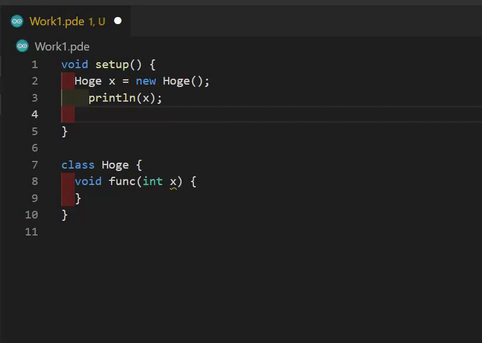

## 実装したもの
シンタックスハイライト、エラー報告、補完、フォーマットができるProcessingのLanguage ServerとVSCodeの拡張機能を実装しました。

### リポジトリ
* https://github.com/kgtkr/processing-language-server
* https://github.com/kgtkr/processing-language-server-vscode

### インストール
以下のリンクからインストールしてProcessing(現在4のbeta1とbeta2にしか対応していません)のパスを設定すれば使えます。設定した後に再起動すると自動でLanguage Serverがダウンロードされます。そのあともう一回くらい再起動が必要かもしれません(ここらへんは動作が不安定なので改善が必要ですね)。
* https://marketplace.visualstudio.com/items?itemName=kgtkr.processing-language-server-vscode

## 作った動機
弊学科の授業では主にProcessingというJavaのような(というかほぼJava)言語が使われています。主にこの言語で課題が出されるのですが、公式のIDEが(VSCodeと比べると)とても使いにくいです(~~あと退屈な課題はCopilotにやらせようをするためにVSCodeを使いたい~~)。VSCodeで編集してコマンドラインから実行することもできるのですが、[一番使われていそうなVSCodeの拡張](https://marketplace.visualstudio.com/items?itemName=Luke-zhang-04.processing-vscode)は補完やエラー報告機能が使えず、あまり快適ではありません。公式IDEにはシンタックスハイライト、補完、定義へのジャンプ、ドキュメント表示、エラー報告、デバッガ、フォーマッタなど一通りの機能が揃っています。この機能(のとりあえず一部)を、Processingのコードから引っ張ってきてlspを喋らせるようにすればVSCodeでも快適に編集できる拡張をそこそこ簡単に実装できるのではと思い作ることになりました。

## この記事のProcessingのコードについて
この記事のProcessingのコードや関数名は4.0b2のものです(GPLで配布されています)。
* https://github.com/processing/processing4/tree/processing-1277-4.0b2

また、解凍したProcessingアプリケーションフォルダ内部のディレクトリ構造などはLinux版のものです。MacやWindowsでは若干異なります。Processingは `$PROCESSING_PATH` にインストールしてあるものとして解説します。

## 大まかな動作
VSCodeの拡張機能をインストールし、Processingのパスを設定すると `$PROCESSING_PATH/lib/version.txt` を読み、バージョン情報を取得します。そして、バージョンにあったLanguage Server本体(Scalaで書かれている)のjarファイルを自動でダウンロードします。

Language Server本体のjarは、Processing本体とProcessingが依存しているライブラリを除いたfat jarファイルです(`sbt-assembly` の `assemblyExcludedJars` を使うとよい)。Processing本体を除いたのは、Processingが `getProtectionDomain` を使ってProcessingのjarファイルがあるディレクトリからの相対パスで様々なファイルを読み込んでいるので、jarに含めてしまうと動かないからです。

Language ServerのjarはProcessingに同梱されているJava11(`$PROCESSING_PATH/java/bin/java`)を使って起動します。この時classpathにfat jarから除いたProcessing本体やProcessingが依存しているライブラリのパスである `$PROCESSING_PATH/lib/*.jar` / `$PROCESSING_PATH/core/library/*.jar` / `$PROCESSING_PATH/modes/java/mode/*.jar` を追加します。このあたりはコマンドラインからProcessingをビルド、実行などをする公式コマンドである `processing-java` のシェルスクリプトを参考にしました。

Language ServerはTCP Socketで拡張機能とやり取りをします。標準入出力でもよいのですが、Processingのコードから標準出力に出力されると死ぬのでやめました。ただWindowsでファイアウォールの確認ダイアログが出てしまうので他のプロセス間通信の方法使ったほうがよい気もします(が一番マルチプラットフォーム対応が簡単そうだったのが標準出力とTCP Socketだったのでとりあえず)。

これによってProcessingさえインストールしてあれば拡張機能をインストールするだけで使えるということを実現しました。

## シンタックスハイライトの実装
これはLanguage Serverには実装しておらず、VSCode拡張に実装しました。Language Serverで意味解析などをしたあとにシンタックスハイライトを上書きすることもできますが、今のところはしてないです。VSCodeのシンタックスハイライトはJSONファイルで正規表現を使って定義できます。予約語や組み込み関数を別の色にするのは、Processingでシンタックスハイライトやトークン解析に使われている `keywords.txt` を使って生成すると楽です。このファイルにはキーワードとキーワードの種類がタブで区切られて列挙してあるので簡単な変換スクリプトを書けばJSONを生成できます。これだけだとコメントやリテラルのハイライトができないので、そこは手書きで実装します。

## ProcessingのコードリーディングとLanguage Serverの実装
エディタ機能を実現するクラスなどは `processing.mode.java` にあります。このパッケージにはJava Modeというおそらく一番よく使われているmodeの実装があります。あまり理解していないのですが、modeというのはProcessingの機能を使う色々な言語風のコンパイラの実装でJava Mode、Python Mode、JavaScript Modeなどが公式やサードパーティーで用意してあります。そしてmodeは `processing.app.Mode` 抽象クラスを継承したクラスとして実装されているので、 最初は `Mode` クラスとやり取りするようにすれば様々なmodeに対応したLanguage Serverを作れるのではと思ったのですが、 `Mode` ではビルドする、トークン解析する、`JFrame` のサブクラスであるエディタを返す程度の抽象化はされていても、補完やエディタ機能として使うことを想定したエラーチェック機能は抽象化されていなかったので諦めました。このような理由でJava Modeだけに対応することになったので、`processing.mode.java` パッケージのコードを見ればよいということです。

このパッケージには、modeの実装(`JavaMode`)や、それが使うコンパイラ(`Compiler` / `JavaBuild`)などがあるのですが、今回はエディタを実装するので `JavaEditor` を読んで、これが使っている機能をGUIに依存しない形でもってくれば実装できます。

また、Language Serverの実装にはlsp4jというライブラリを使いました。

### Sketchクラス
Processingのプロジェクトを表すクラスとして `processing.app.Sketch` 、1つのソースコードを表すクラスとして `processing.app.SketchCode` があり、これを様々なメソッドから求められるのでLanguage Server内部のコード管理にもこれを使います。このクラスは基本的にGUIには依存していないので安心です(メソッドによっては特定の条件で呼ぶとモーダルを出したりするので注意が必要ですが)。
しかし、ファイルシステムをモックするようなことはできず、実際のファイルシステムに依存することになるのはきついところです。Language Serverはファイルを一意に識別する文字列としておそらくfileプロトコルであることは保証されていないURIを渡してくるので、これを使ってファイルをインメモリやtmpフォルダで管理するべきだと思うのですが、今のところはできておらず、fileプロトコルでないと動きませんがVSCodeでは動いているのでとりあえずよしとします。リフレクションとか使えばできるんですかね？(JSだったらprototype書き換えでどうとでもなりますが)

### 初期化
`processing-java` の実装である `Commander` を参考に Language Serverの `initialize` 時に `Base.setCommandLine()` / `Platform.init()` / `Preferences.init()` あたりを呼んで初期化します。

### フォーマッタの実装
これはとても簡単で `AutoFormat` クラスに文字列を渡すとフォーマッタした文字列を返してくれるメソッドがあるのでそれを使うだけです。フォーマット結果をソースコード全体を置換する `TextEdit` として返せばよいです。

### エラーチェックと補完の実装
#### PreprocServiceクラス
jdtを使ってコード解析などを別スレッドでしてくれるクラスです。コード解析の結果は `PreprocSketch` というクラスのインスタンスとして返ってきます。そしてこれらのインスタンスを補完やエラーチェックをするクラスから求められるのですが、 `PreprocService` のコンストラクタは `JavaEditor` を求めており、 `JavaEditor` は `JFrame` のサブクラスです。つらいですね。しかしコードを読むと `JavaEditor` のインスタンスは `Mode` と `Sketch` のインスタンスを取得するメソッドくらいしか使われていないので、 `Mode` と `Sketch` を直接コンストラクタで要求する形にパッチを当てて `PreprocService2` というクラスにしてしまいこれを使います。

このクラスはコードの変更を `notifySketchChanged` メソッドで通知し、 `whenDone` のコールバックで `PreprocSketch` のインスタンスを受け取ります。

#### ErrorCheckerクラスとエラー報告の実装
Processingのエラー(構文解析のエラーなど)と、Javaのエラー(型エラーなど)をProcessingのエラーに変換し、マージしたりしているクラスです。`PreprocService` と `JavaEditor` に依存しているので、`PreprocService2` に依存させたり、 `JavaEditor` にエラー報告している部分をコールバックでエラーを渡してくれるようにするパッチを当てて `ErrorChecker2` というクラスにしてしまいます。

そしてこのクラスもコードの変更を `notifySketchChanged` という関数で通知します。
エラーチェックの実装はコールバックで飛んでくる `processing.app.Problem` 型のリストを、 lspの `Diagnostic` に変換して `publishDiagnostics`で通知します。ちなみに `publishDiagnostics` のエラー報告はファイルごとなので、前回のエラー報告でエラーがあったが、エラーがなくなったファイルも空のエラー報告で更新しないとエラーが消えずに困ります。

#### CompletionGeneratorクラスと補完の実装
このクラスは `JavaEditor` に依存せずに補完を生成してくれるのでパッチを当てる必要はありません。しかしprotectedメソッドは呼ぶ必要があるのでリフレクションを使ってなんとかしましょう。`CompletionGenerator` クラスの使い方は `JavaTextArea` の `fetchPhrase` を参考にしました。まず `PreprocService` が生成してくれるコード解析の結果である `PreprocSketch` クラスを使って、ProcessingコードをJavaにトランスパイルした後の行番号を `tabOffsetToJavaLine` を使って得ます。その後 `JavaTextArea` のstaticメソッド `parsePhrase` を使ってカーソルがある行のコードを `CompletionGenerator` が求める形に変換し、 `CompletionGenerator#preparePredictions` を呼んで補完候補を表すクラスである `CompletionCandidate` のリストを得ます。その後 `CompletionGenerator` のstaticメソッド `filterPredictions` を呼んで補完候補をさらにフィルタリングし、LSPの `CompletionItem` に変換して結果として返します。

`CompletionItem` への変換では、 `label` に関数のシグネチャなどがありますが、htmlなので適当なパーサーでパースした後に文字列部分だけ抽出して `detail` に設定しましょう。また、関数呼び出しの補完では括弧やカンマも引数の数に応じて返ってくるのでlspのスニペット構文を使って `$1` などを追加し、補完を使いやすくしました。

## 今後
今後は安定化と、対応する括弧のハイライト機能がないなど細かい使いにくいところの改善、定義へのジャンプやドキュメント表示などの機能追加を行っていきたいです。デバッガはlspみたいなDebug Adapter Protocolというのがあるらしいので、それに対応するようなサーバーを作れたらよいのですが、大変そうなので今のところは作るか未定です。
