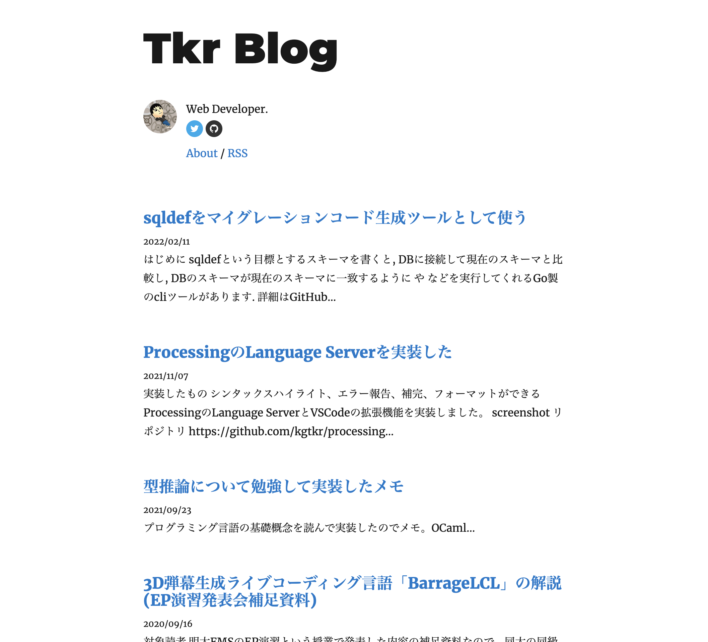
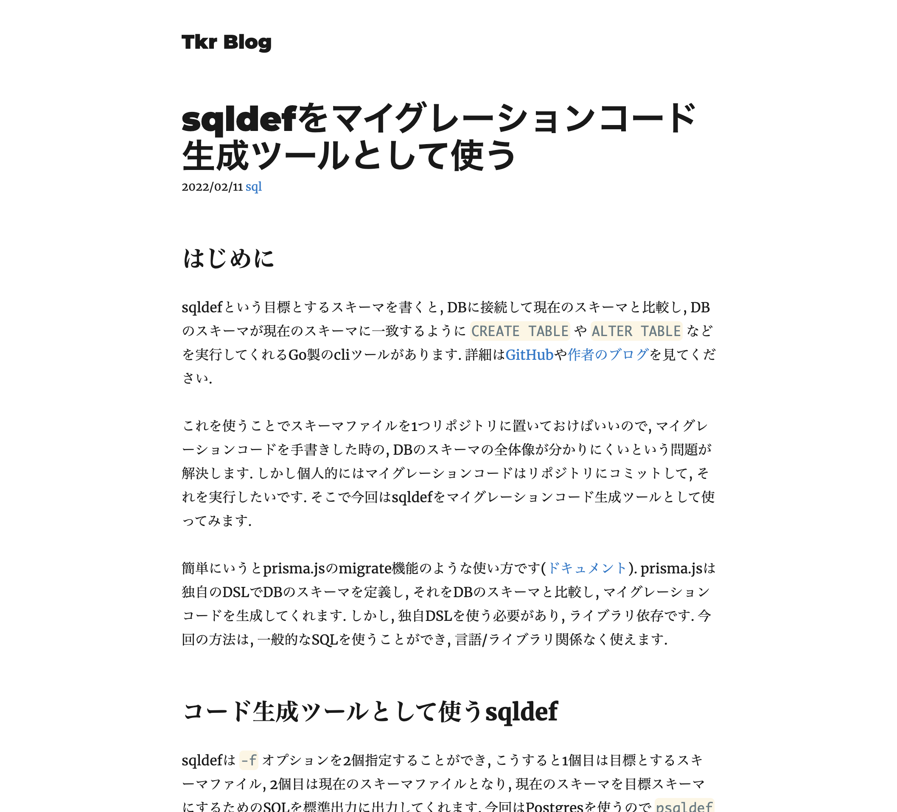
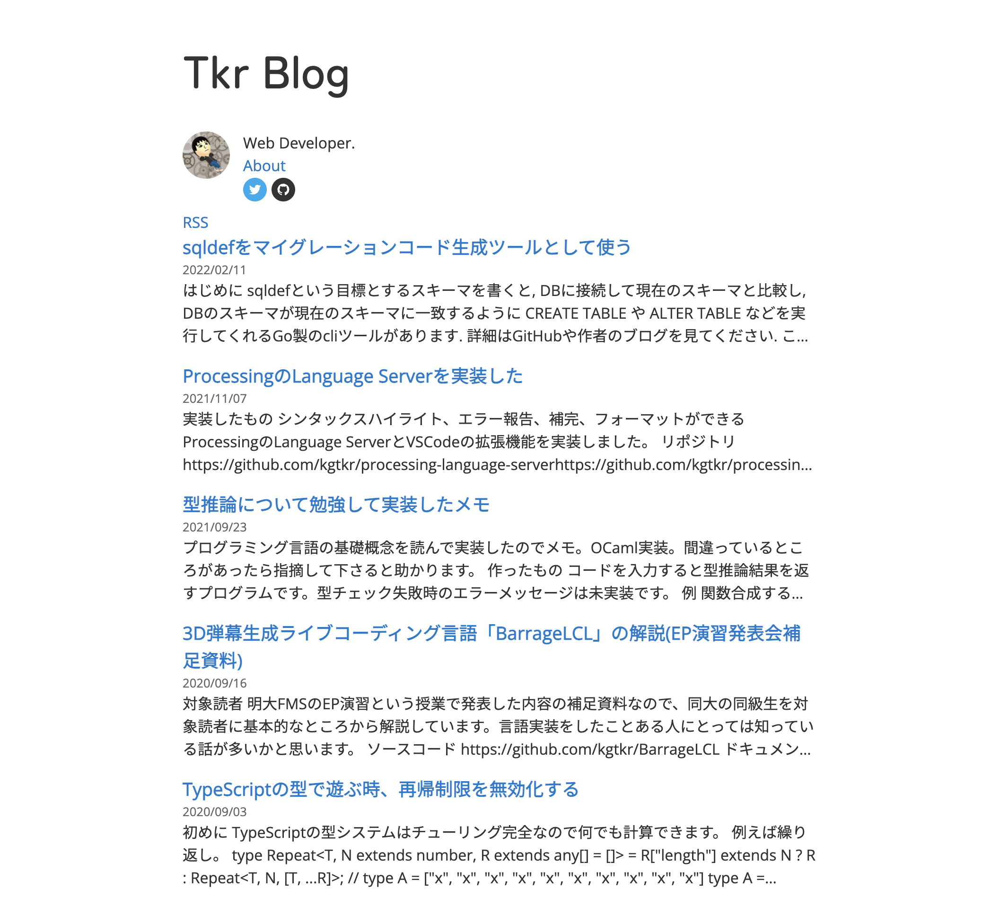
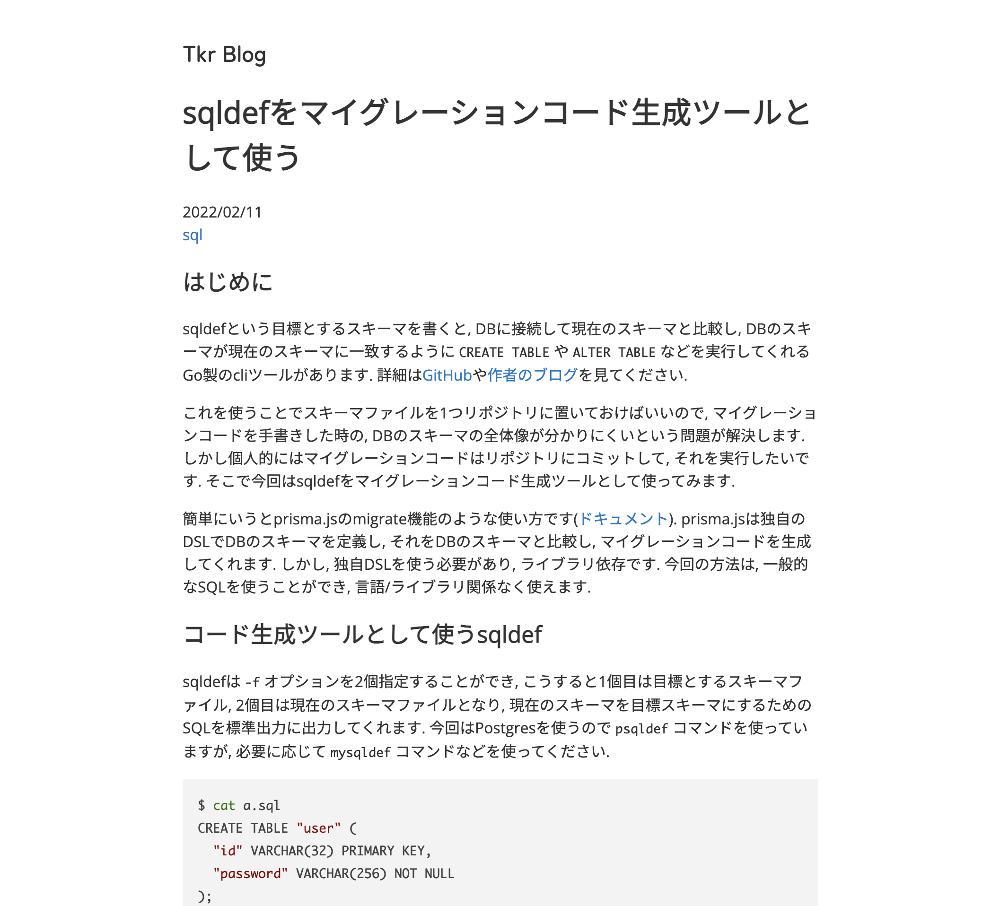

# ブログをNext.jsに移行した
今までGatsbyで作っていたブログをNext.jsに移行しました.

## 動機
Gatsbyの依存関係を久しぶりに更新しようと思ったら新しいメジャーリリースが出ていたり, 大量のプラグインを入れていたことが原因で移行が大変そうだったというのが動機です. Gatsbyはデータの処理にGraphQLを多用しているところなどあまり好きになれない部分があり使うのをやめたいと前から思っていました. またNext.jsはこれだけ有名なフレームワークなのに今まで一度も触ったことがなかったので使ってみることにしました. Reactやunified周りはそこそこ触ったことがあったので, 移行は比較的やりやすかったです.

## 大きな変更点
Gatsbyで動かしていた時はGitHubにpushしたらNetlifyでビルドが走りデプロイされるというよくあるお手軽構成でした. 今回は, 最近自宅k8sクラスタを立てて, argocdなどを導入したことでGitHubにpushしたらGitHubのWebUIをポチポチするだけでデプロイができるようになったこともあり, 今のところはその上で動かしています. とはいえ静的サイトなので早めに何らかのCDNは導入したいですね.

## Markdownから相対パスで画像を読み込みたい+Next.jsの画像最適化もしたいなど
Webpackの `context` というディレクトリ内のファイル全部 `require` するような機能+rehypeのASTをReactのElementに変換するときに独自のコンポーネントを使うように設定する機能あたりを組み合わせていい感じにしてやると上手くいきます. Webpackのこの機能便利ですね.

* [lib/blog.tsx#L13](https://github.com/kgtkr/kgtkr.net/blob/cf57a08ba1a432dcff1a2548615973795c18969d/lib/blog.tsx#L13)
* [lib/markdown.tsx#L75](https://github.com/kgtkr/kgtkr.net/blob/cf57a08ba1a432dcff1a2548615973795c18969d/lib/markdown.tsx#L75)

## 軽いServiceWorker関連のハマりなど
`gatsby-plugin-offline` を導入していたことが原因で, 過去にこのブログにアクセスしたことがあるブラウザにはService Workerが登録されていて色々壊れるという問題が発生しました. 調べたところ `gatsby-plugin-remove-serviceworker` というgatsbyのプラグインを導入すればoffline pluginやめられると出てきたのですが, 今回はgatsby自体をやめるので下のファイルを `sw.js` として配信することで無事解決しました.
https://github.com/NekR/self-destroying-sw/blob/master/packages/gatsby-plugin-remove-serviceworker/sw.js

## スクリーンショット
## Before

## After

