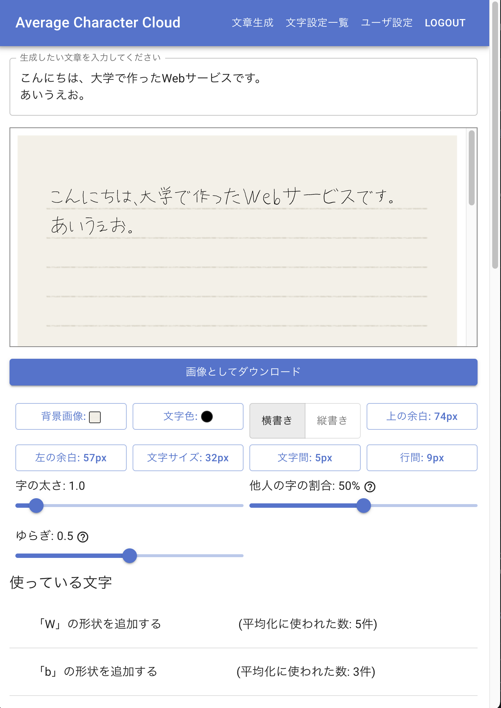
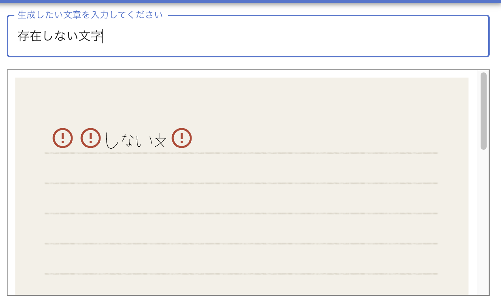
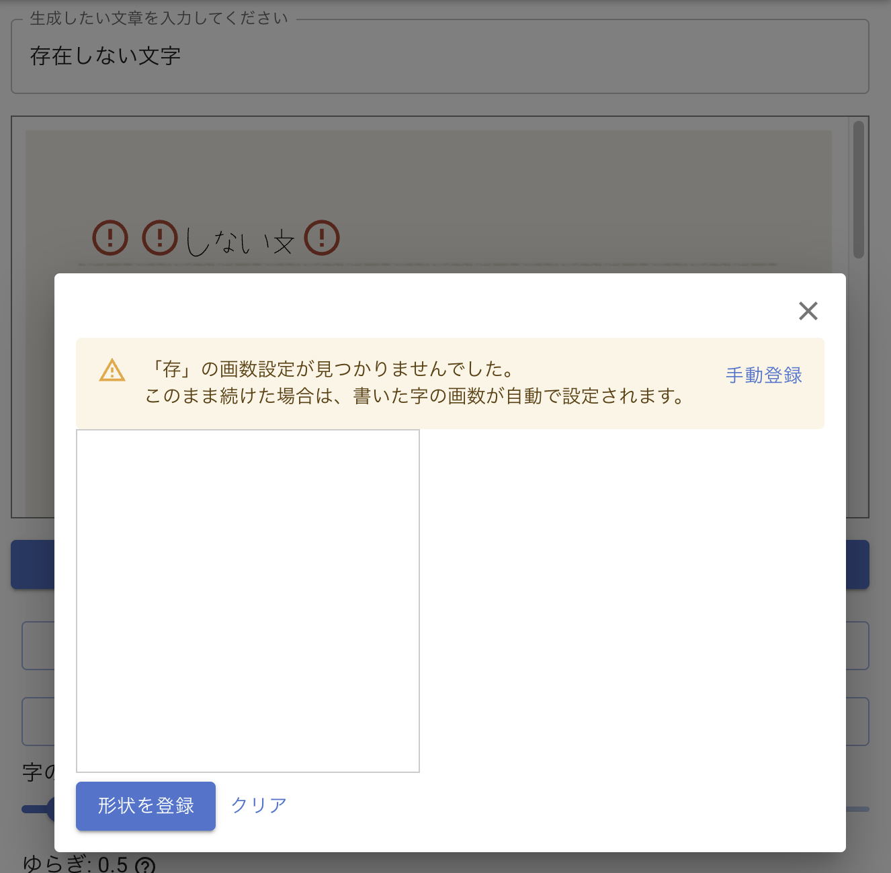
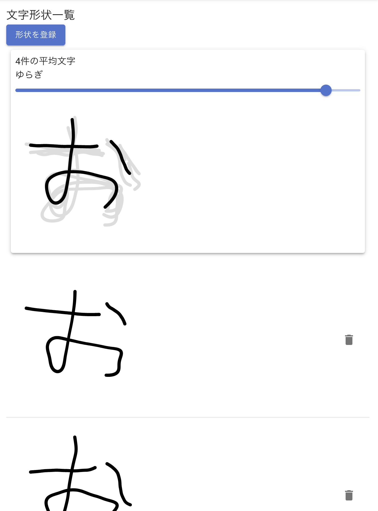

## はじめに
2022年度の大学のプロジェクトで(今更すぎる)手書き風の画像を生成するWebサービスを開発したのでそれについての話です。

## リンク
* [tegaki.fun](https://tegaki.fun)
  * サービスのURL
* [nkmr-lab/average-character-cloud-backend](https://github.com/nkmr-lab/average-character-cloud-backend)
  * バックエンドのリポジトリ
* [nkmr-lab/average-character-cloud-frontend](https://github.com/nkmr-lab/average-character-cloud-frontend)
  * フロントエンドのリポジトリ
* [nkmr-lab/average-figure-drawer](https://github.com/nkmr-lab/average-figure-drawer)
  * 平均手書き文字(手書き文字の合成文字)を生成するライブラリのリポジトリ。研究室で数年前に作られた物をTypeScript化(不完全)するなどしただけで、上2つと違って1人で書いたわけではない。

## サービスの概要
下の画像のように、上のテキスト欄に文字列を入力すると、その文字列に対応する手書き風の画像を生成してくれます。背景画像はユーザが用意してきて、それに合わせて文字サイズや書字方向、行間字間などを設定する仕様です。各文字は、ユーザが登録した手書き文字を複数組み合わせて平均手書き文字という手法で合成し、生成されていますが、これを行うには1字につき複数の手書き文字を登録する必要があり手間なので、デフォルトでは、許可された他のユーザが書いた手書き文字も生成に取り入れる仕様になっています。


まだ字が登録されていない場合は、以下の画像のように警告が表示されるのでクリックすることで字を書けるようになっています。登録画面を完全な別ページではなく個別のパスが割り振られたモーダルを使うといったUIはTwitter風のあれですね。最初は別ページでしていましたがあまりに使いにくかったので。



後は、登録した手書き文字の一覧と、それらの合成結果を確認できるページもあります。


## バックエンド
バックエンドは言語はRustでactix-web(Webフレームワーク)+juniper(GraphQLライブラリ)、sqlx(SQLライブラリ)あたりを使っています。ずっとここらへんの技術スタックでバックエンド書きたいと思っていたので、いい機会でした(手書きには興味がなかったがここらへんの技術を試すために何かWebサービス作りたい気持ちがあったので提示されたテーマの中でこれを選んだ)。全体的にかなり開発体験はよかったです。特にsqlxが、生SQLの変なDSL覚える必要がなく、複雑なSQLも書けるという利点と、ORMの型安全(物による)という利点の両取りができて本当に便利だったので、ORMにはもう戻れません。こんなレアな技術スタックのプロジェクトを研究室内で誰が引き継ぐんだという問題点はありますが…(Rustなんて当然触ったことある人いないし、フロントエンドもVue派が多数なのにReact+Relay+Recoilという)

技術スタック自体はわりとレアですが、まあ普通のCRUD APIです(説明するよりコード読んだ方が早いと思う)。昔紹介した[「sqldefをマイグレーションコード生成ツールとして使う
」](/blog/2022/02/10/sqldef-for-generate-migration)方法を使っていたり、
`serde-env` で[環境変数のデコードをしていたり](https://github.com/nkmr-lab/average-character-cloud-backend/blob/7f3a6df495985da7932ebdd881529db529715e72/src/app_config.rs)(これに使うためにenum対応PRを投げたりした)ここらへんはRustでバックエンドを書くときに便利だと思います。

### API設計
フロントエンドでRelayを使いたいのでRelayの[GraphQL Server Specification
](https://relay.dev/docs/guides/graphql-server-specification/)を満たすようなAPIにする必要があります。

まず、`id` フィールドはグローバルに(異なる型であっても)一意である必要があります。またbase64でエンコードすることが推奨されているので `Hoge` 型の `xxx` というidであれば `Hoge:xxx` をbase64エンコードしたものにしました。しかし、`xxx` が欲しい場合もあるので `id` フィールドはGraphQLのidという扱いにし、ドメイン層のidである `xxx` は `hogeId` というフィールドに別に入れています。

また、mutationのエラーはGraphQLのエラーではなくエラー型の配列として返した方がフロントエンドから扱いやすいです(Goのような感じ)。あとは `Query` 型にはとりあえず `query: Query!` を定義しておきましょう。これがあると `Query` 型の `fragment` を定義できるようになるなどフロントエンド側で嬉しいことがあります。

### エラー処理
juniperのエラー処理について便利な方法を紹介しておきます。APIのエラーは大きくバリデーションエラーのようなユーザの不正な入力が原因のエラーと、DB接続エラーのような内部エラーに分けられます。後者はエラーログに記録する必要がありますし、ユーザに詳細メッセージを返すことはセキュリティ上適切ではありません。juniperでは、`IntoFieldError` トレイトを実装した独自のエラー型を定義できるので、これを上手いこと扱える仕組みがを作りました([ソースコード](https://github.com/nkmr-lab/average-character-cloud-backend/blob/7f3a6df495985da7932ebdd881529db529715e72/src/graphql/common.rs#L14))。

まず、 `GraphqlUserError` と `ApiError` という2つの `anyhow::Error` のnewtypeを用意します。`GraphqlUserError` は `Error` トレイトが実装してあるので `anyhow::Error` に変換できます。つまり `anyhow::Error -> GraphqlUserError -> anyhow::Error` という変換が可能です。この変換を行うと元のエラー情報を完全に残したまま、`err.downcast_ref::<GraphqlUserError>()` によって `GraphqlUserError` 型へのダウンキャストが成功するようなエラー値を作ることができます(`GraphqlUserError` というマーカーがついているイメージ)。そして、`GraphqlUserError` にダウンキャストできればユーザが原因のエラー、そうでなければ内部エラーという扱いにしました。

次に `ApiError` に `IntoFieldError` トレイトを実装します。このトレイトでjuniperが要求する形式への変換関数を定義します。この変換処理の中で、`GraphqlUserError` へのダウンキャストを試み、成功すればユーザに詳細メッセージを返す、失敗すれば詳細メッセージはエラーログに記録し(変換関数で副作用を起こすのはどうなのかという問題はありますが他に良い方法が見当たらなかった)、`Internal error` というメッセージのみを返すということを行なえば目的を実現できます。

### N+1問題
GraphQLといえばみんな大好きN+1問題です(本当に？)。これを解決するには `dataloader` クレートを使うのですが、GraphQL APIを作るには `HashMap<Param, Loader<Key, Value>>` のような役割の異なる `Param, Key` (独自用語)という2つの値を受け取れるものがあると便利なので[ラッパー](https://github.com/nkmr-lab/average-character-cloud-backend/blob/7f3a6df495985da7932ebdd881529db529715e72/src/dataloader_with_params.rs)を作りました(`DataloaderWithParams`)。

`Param, Key` を説明するために以下のようなクエリを考えてみましょう。

```graphql
query {
  users {
    hoge: posts(
      filter: "hoge" # Params
    ) {
      title
    }
    foo: posts(
      filter: "foo" # Params
    ) {
      title
    }
  }
}
```

この時 `posts` は暗黙の引数(?)として親の`user`を受け取ります。この場合の親の`user`を `Key` と呼びます。親の`user`はいくつになるか分からないので、単純な実装だとN+1回のSQLを投げてしまうというのがN+1問題です。また、明示的な引数として`filter` も受け取ります。この場合の`filter`を `Param` と呼びます。`filter` は親の`user`に依存することはないので、このパラメータのパターン数は高々クエリの長さに比例します。よって、異なるfilterに対して複数回のSQLを投げても大きな問題にはなりませんし、ここまでまとめようとするとSQLが複雑になりすぎてしまいます。

以上の理由から、`Param` が異なる場合はSQLを別々に投げたいですし、そうでなければ `Key` が異なっていてもなるべくSQLをまとめたいです。そこで `Param` ごとに `Loader` を自動的に作って、いい感じにクエリをまとめてくれるような型が `DataloaderWithParams` です。

## フロントエンド
フロントエンドは言語はTypeScriptでReact / Recoil(状態管理ライブラリ) / Relay(GraphQLライブラリ)あたりを使っています。全体的に使いやすかったのですがRecoil最近更新があまりされているようなので少し不安ですね(Jotaiあたりを使うべきかも)。

### Fragment Colocation
GraphQLのFragment Colocationというものがとても便利でした。解説記事が沢山あるのでここでは詳細は書きませんが、簡単にいうと、コンポーネントごとに欲しいデータをfragmentとして定義しておき、それをまとめてルートのコンポーネントでfetchすることができるというものです。これによってデータを一回のクエリでfetchすることができます。特にRelayでは他のファイルで宣言したfragmentのプロパティにはアクセスできないという厳密なカプセル化がされているので、カプセル化とデータをまとめてfetchしたいという2つの両立が可能です。

### recoil-relay
ほとんど更新がされていないのとpaginationに対応していなかったり、[データの再フェッチができない](https://github.com/facebookexperimental/Recoil/issues/2127)といった問題があるので、公式の組み合わせだと思って使うと痛い目にあいます。このライブラリがなくてもrecoilと組み合わせることはできるので、基本的に使わなくていいでしょう(試しに使ってみたがさっさと依存を剥がしたい)。

### キャッシュの更新
[Staleness of Data](https://relay.dev/docs/next/guided-tour/reusing-cached-data/staleness-of-data/)あたりを読むとデータの再フェッチの方法が分かると思います。

単一のデータであればドキュメント通りですが、複数のデータの(例えば `user` が持っている `posts`)配列が更新された場合どうするかという問題があります。これは例えば `user` 自体を `invalidateRecord` してしまうのが手っ取り早いです。こうすることで `user` に属する `posts` も再フェッチできます(当然 `useSubscribeToInvalidationState` で `user.id` を監視する必要があります)。

### 文字の合成はWebWorkerでしよう。Comlinkの話
文字の合成処理はフーリエ変換などが必要なためかなりCPUバウンドな処理です。本来はバックエンドで行なって計算結果をキャッシュするのが理想ですが、平均文字ライブラリはTS製、バックエンドはRust製なので、Rustでライブラリを書き直すか、ここだけマイクロサービス化するなどしない限りバックエンドで行うことはできません。今回は手を抜いてフロントエンドで行うことにしましたが、当然CPUバウンドな処理をメインスレッドで行うことはできません。はい、WebWorkerの出番です。

WebWorkerを生で扱うのはめんどくさいので[comlinkという便利なライブラリを使いましょう](https://github.com/nkmr-lab/average-character-cloud-frontend/blob/80f3ac7de7a92a4822864d43f2e1142b78b0ad60/packages/client/src/store/averageFigure.ts)。そして大量の文字の合成を並列で行うために[cpu cores数分workerを用意](https://github.com/nkmr-lab/average-character-cloud-frontend/blob/80f3ac7de7a92a4822864d43f2e1142b78b0ad60/packages/client/src/WorkerPool.ts)しましょう。


### SuspenseのPromiseの管理をrecoilに任せる、selectorFamilyにRecoilValueを渡す
Reactの `Suspense` に対応したデータロード関数を作るにはReact外でのグローバルなデータ管理の仕組みが必要です。例えばRelayは特に何も考えなくてもこれを行なってくれますが、独自で作ろうとすると単純な実装であればともかく、メモリリークを防ぐといったことまで考慮するととても大変です。そして、今回は文字の合成処理でWebWorkerを使っており、これを `Suspense` に対応させたいのでこの問題を解決する必要があります。

そこで汎用的なPromiseの管理場所としてのrecoilの `selectorFamily` の出番です。`selectorFamily` はパラメータを受け取ることができる selectorで、非同期なselectorをrecoilはサポートしているので、何も考えずにasync関数を定義するだけで勝手にグローバルなPromiseの管理をしてくれます。便利ですね。

ところで `selectorFamily` は `Map<Parameter, Selector>` のようなものを作る関数なので、引数のパターン数が多すぎるとメモリ効率が悪いです。また、パラメータに使える型にはシリアライズ可能である型である必要があるという制限があります。そこで、`selectorFamily`に`RecoilValue` (atomやselectorの親の型)を渡せるという仕様を利用します。こうすることで、渡せる値に制限がなくなり、またMapの要素数の増加を抑えることができます。

### useTransition
画像生成処理は `useTransition` を上手く使うことでパラメータ変更による再生成時のローディング表示を抑えることができ、使いやすくなりました([ソースコード](https://github.com/nkmr-lab/average-character-cloud-frontend/blob/80f3ac7de7a92a4822864d43f2e1142b78b0ad60/packages/client/src/pages/Generate.tsx))。スライダーの更新などは `react-use` の `useDebounce` を使って更新頻度を下げることでCPU負荷を下げる必要があります。また、`useDebounce` の第一引数に渡すコールバックで `startTransition` を使うことで上手く組み合わせることができます。

### グローバル汚染する悪いライブラリはiframeに閉じ込めよう
このプロジェクトは板タブ液タブなどを作っているwac⚪︎mとの共同研究なので、WILLというwacomが提供している手書きライブラリを使う必要がありました。そしてこのライブラリはグローバル汚染をするので他のコードが動かなくなるという~~自主規制~~みたいな問題があります。仕方がないのでiframeに閉じ込めて(そうすることでメインのJSランタイムとは独立したランタイムで動かすことができる) `postMessage` でデータをやり取りすることにしました。

WILLはnpmでインストールすることはできず、ダウンロードするのにログインが必要なので自動化も難しく、リポジトリに含めるのもライセンス的に微妙なのでこの部分のコードは別のprivateリポジトリで管理してあります。frontendだけ履歴が消えているのは公開時に履歴にWILLのライブラリが残っているのはまずいという話になったからです。悲しい。

以上の理由で、[公開リポジトリにあるコード](https://github.com/nkmr-lab/average-character-cloud-frontend/blob/80f3ac7de7a92a4822864d43f2e1142b78b0ad60/packages/client/canvas/app.js)はcanvasを使った簡単なモックです。本番環境では `/canvas/` 以下へのリクエストをWILLを使ったバージョンを配信するWebサーバーにプロキシすることで動作を変更しています。~~少しマイクロフロントエンド(※この用語を何も知らないので完全に適当なことを言っています)っぽい。~~
