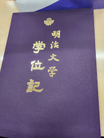

## はじめに
3月に明治大学総合 数理学部を卒業し、電気通信大学情報 理工学研究科の修士課程に進学しました。

大学院の授業の初週が終わったので、大学生活を振り返ったりなどなど適当に書くだけの記事です。

## 大学入学〜2年生までの話
現役のとき推薦や一般入試などに全落ちし、浪人生のときに自己推薦入試で、作っているWebサービスの話をしたら運良く拾ってもらい入学することになりました。一般入試ではかなりレベルの低い大学も落ちていて、受かっていても多分やりたいことはできなかったので入学できたのはラッキーでしたね。

そんなこんなで始まった大学生活ですが、入学したのが2020年だったのでコロナの影響で授業開始が5月になり、夏休みまで一度も大学に行かずにオンライン授業を受けていました。ただ1年生の授業は教養科目やプログラミングの基礎、数学の授業などが多く、特に困ることはありませんでした(というか数学の授業は眠くなるので録画のほうが嬉しい)。

学科の授業は全体的に緩く、雑に取っても単位はもらえるので音響やCGなど自分1人では絶対に勉強しないような授業を取って概要を学ぶにはちょうどよかったです。

## 研究室配属以降の話
2年生から一応研究室に配属されるのですが、本格的に研究ごっこをするのは3年生の本配属からです。2年生のときから3年間WebやHCIっぽいことをやっている研究室に所属していました。8人*4学年より少し少ないくらいの30人弱の学生がいるマンモス研究室でした。先生1人でこれだけの人数を見るのはかなり大変そうでしたね。

普段のゼミは3週間に一度回ってくる5分間の論文紹介で、これは自分の好きなプログラミング言語の論文の話などをしていました。5分間で1から説明するのは難しかった(というか無理)です。あとは年2回の合同研究会、年1回の合宿、年1回の学会発表ノルマがあり、研究室の金で京都・大阪や淡路島、伊豆大島あたりに行くことができました。

3年生のときは[手書き文字を生成するWebサービス](blog/2023/08/01/tegakifun)に関することをしていました。これは実装さえしてしまえば実験などは共著の先生に投げられたのでかなり楽でした。RustのバックエンドやRelayなど気になっていた技術の実験台としてちょうどよかったです。

4年生のときはProcessingにホットリロード機能をつけるという内容で研究を行っていました(気が向いたら別記事で詳細書きます)。HCI系の研究室なのにプログラミング言語に関することをやらせてもらえたのはよかったですね(ありがとうございました)。

論文を書いたり発表したりなど苦手なことをやらないといけないことが多く大変でしたが、そこらへんの指導は丁寧にやってもらえて少しはできるようになったのかなと思います。

## 院試の話
元から自作言語を作ったりしていて、言語にかなり興味があったので、専門的な先生がいる大学院を受けることにしました。元から他大の院進を考えていたとはいえ、同期8人中自分以外の7人は研究室に残るので寂しいですね。受験する大学は東工大なども考えたのですが、日程が電通大と被っていたのでより受かる可能性が高そうな電通大を受けました。

電通大の院試はTOEICと面接が100点ずつ、筆記が400点(多分)とかなり筆記重視になっています(外部生に優しい)。とはいえその大学の学部の授業の内容から出るので外部から受けるのは少し大変です。自分は選択科目が足りず、慌てて追加で1科目勉強しました。学部の入試と違い、応用的な問題はほとんどなく、基礎的な問題が多めなので、入試のために練習問題を大量に解く必要はなく、教科書を読んで少し練習問題を解けばいいのは、受験のためだけに勉強するやる気が起きない自分としてはありがたいですね。

TOEICも英語が無理なので壊滅的で、筆記もあまり手応えがなく、面接も反応が悪かったので絶対落ちたと思ったのですが、なぜか受かっていました。よくわかりません。成績開示してみようと思います。

## 入学して2週間を振り返って
授業の数が多い(=教員の数が多い)ところや、研究室の人数が半分以下(これでも今年は多いらしい)なところはさすが国立大学ですね。HCI系の先生が多い学科だったので低レイヤーなどのCS！！！って感じの授業がたくさんあるのは感動です。研究室の人とも少し話した程度ですが、前までと違い技術が好きな人もわりといそうですし、これから楽しみですね。

これは明治大学の中野キャンパスが特殊なんですが、できて10年程度しか経っておらずめちゃくちゃ綺麗なのと、建物がでかいビル一個だけなので「普通の大学」って感じの構造には慣れる気がしません。建物古すぎ&多すぎ。今はいいけど梅雨とか真夏とか真冬とか移動が室内で完結しないのでつらそう。

まあ留年せずに卒業することを目標に頑張ります。
