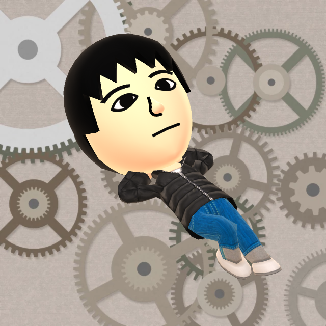
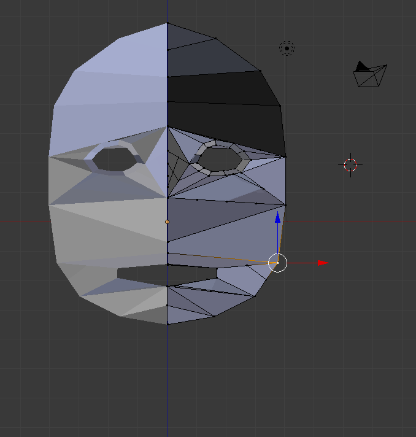
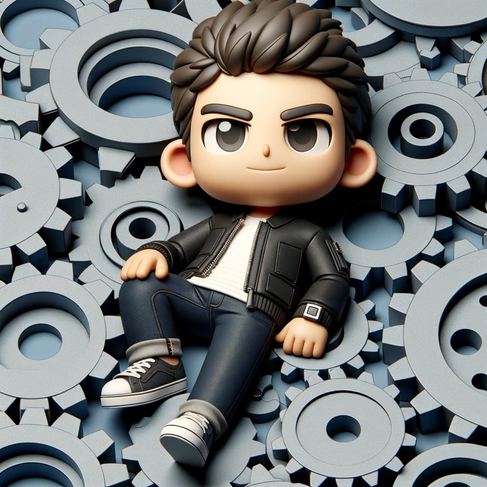
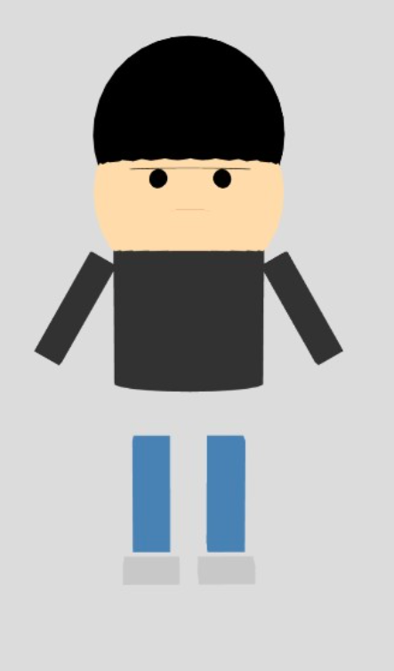
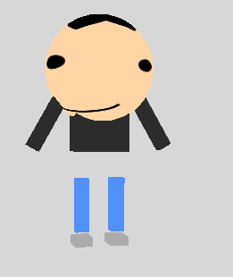
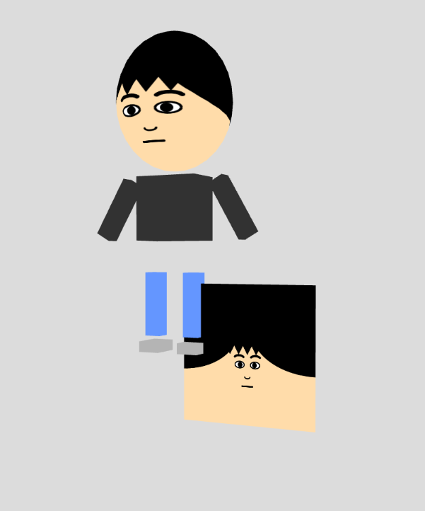
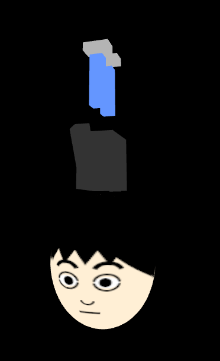
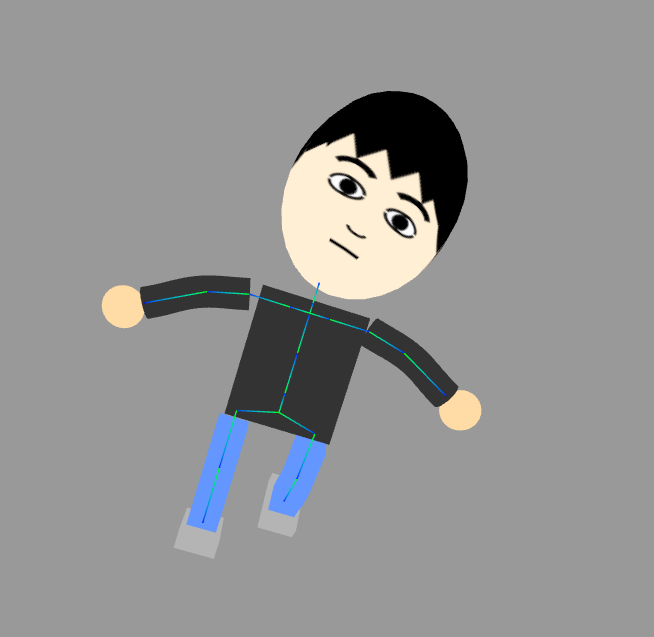
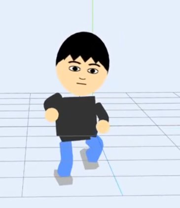

## 現在使っているアイコン、そして変えたい

各種SNSなどで使っているアイコン、Miitomo(2016～2018)という任天堂がかつて出していたアプリで2016年頃(記憶が曖昧)に作って9年くらい使い続けています。

そして飽きたとか、権利的にもっと自由に使えるものが欲しい(SNSのアイコンに使うくらいなら大丈夫なはずだけど…)などの理由で2019年くらいからアイコンを変えたいと言い続けており、過去にはBlenderに手を出して挫折したりもしました。

また、変えたいとはいいつつも、長い期間同じアイコンを使い続けてしまったので、遠目で見れば大体同じに見えるものにしたいです(たまにアイコンで認識されている人がいるので)。

## 画像生成AIにお願いしてみよう、でも再現性がない
ここ数年画像生成AIなどというものが流行っており、頼めばアイコンくらいならさっと作ってくれます。例えば少し前にCopilotに「今使っているアイコンと似たような構図のイラストを描いて」とお願いしたら↓のようなものを出してくれました。まあ悪くはないですね。

ただこれ、ちょっと背景を変えたいとか、ポーズを変えたいなどと思ったときに対応が難しいです。同じキャラクターの別のバリエーションを作れません。そして、そもそも元アイコンと生成画像は似ているけど別キャラクターです。せっかくならキャラクターの一貫性が欲しい。画像生成AIの使い方に慣れている人ならできるのかもしれませんが…。

## バリエーションを作りたいなら結局3Dモデル
ポーズとか背景を変えたいなら結局3Dモデルが一番楽です。

でもモデリングはもうしたくありません。3Dモデル自動生成サイトみたいなのをいくつか試しましたが、どれも思ったようにいきませんでした。もしいい感じの3Dモデルを自動生成できてobjファイルとか渡されても、結局画像生成結果返されるのと同じで自力で修正できませんし、それも嫌ですよね。

アイコンをよく見てみると3Dモデル自体は別にそんな複雑ではないです。単純な球などの組み合わせで再現できる構造をしています。SVGの3D版とかあればそれだけで作れそう。それなら3D描画ライブラリで描けそうです。

ということで少し触ったことがあるp5.jsの3D描画機能を使ってアイコンっぽいキャラクターを作ってとChatGPTにお願いしてみます。

ちょっと違うけど欲しいのはこういうのです。目なども球で表現していたのですが、一旦立体感いらないのでテクスチャ画像貼り付けたほうがよさそうですね。テクスチャ画像もp5.jsの2D描画機能で作ってしまいましょう。頼んだChatGPT！

？？？？？？？？？？？？？。ﾄﾞｳｼﾃｺｳﾅｯﾀ…。まあ全てコードで表現されているので自力で調整できます。色々なおしましょう。

平面の画像はデバッグ用に表示しているテクスチャ画像です。改善の余地はありますが、一旦これでよしとしましょう。

## 他アプリケーションでも使える形式でエクスポートしたい
一旦これでp5.jsで描画できるようになりました。でも他のアプリケーションから使えるような3Dモデルのフォーマットではありません。p5.jsから3Dモデルファイルとしてエクスポートできないか調べてみましたがあまり柔軟性はないようです。three.jsという高機能なライブラリならそういうこともできるらしいのでまたChatGPTに頼んで移植してもらいました。座標系が違うなどの問題で少しバグってましたが(↓の画像)、まあ一発で大体上手くいきました。

そして `GLTFExporter` というものを使えば簡単にgltf形式でエクスポートでき、テクスチャ含めて他のアプリケーションでも使えるようになりました。めでたしめでたし…？

## VRMに対応したい
ここまでやったならVRM(周りにVRChatなどをやってる人がいるので名前だけ知っている)とかいうやつに対応したくなります。そのためにはまず骨格というものを設定しないといけないらしいです。BoneとSkeletonの違いは？Mesh、Material、Geometryって何？？？などとなりながら(ChatGPTに概念の説明をしてもらいながら)ごにょごにょ設定していきました。

ここまで出来たら最後はVRMファイルを出力するだけです。色々調べてみると、VRMはGLB(GLTFはJSONだが、それをバイナリにしたもの)の拡張プロパティに色々(このBoneは人間の腕だよ～とか)必要な値を設定して拡張子を変えたものであることが分かりました。なんかできそう。しかし、作り方を調べてもBlenderやUnityを使って変換しろとしか出てきません。でもここまでコードで完結させて最後の変換部分だけGUIで色々設定して…とかやりたくないですよね。ということで [このページ](https://github.com/vrm-c/vrm-specification/blob/c24d76d99a18738dd2c266be1c83f089064a7b5e/specification/VRMC_vrm-1.0/humanoid.ja.md)を見たりなどして設定しました。`GLTFExporter`の制限でルート要素に拡張プロパティを簡単に設定できなかったりしてハマりましたが、まあなんとかなりました。

ということでVRM Viewerの1つに読み込ませてみました。

なんか今のモデルだと他のVRM Viewerに読み込ませるとエラーになったりするのでもう少し改善が必要そうですが…まあ一旦ヨシ

## ソースコード
https://github.com/kgtkr/kgtkr-icon/blob/1185c5bffca7d8b7918cc96e6b75c5f00c606560/src/index.ts
