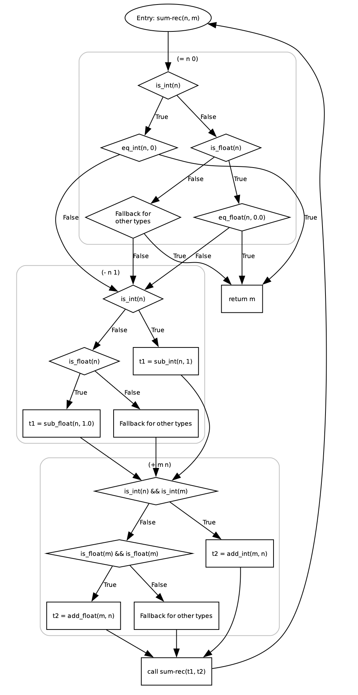
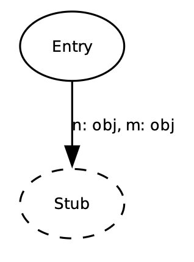
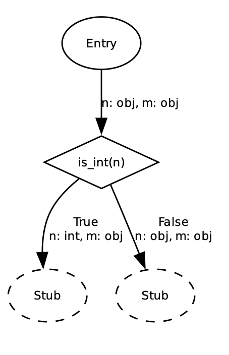
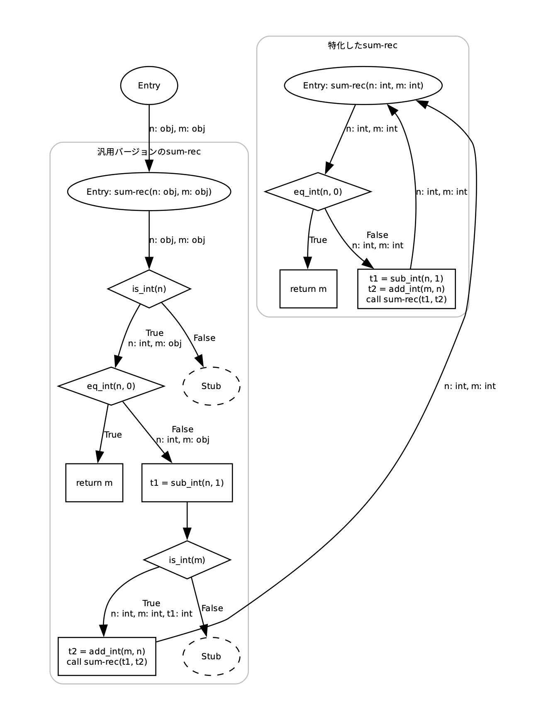
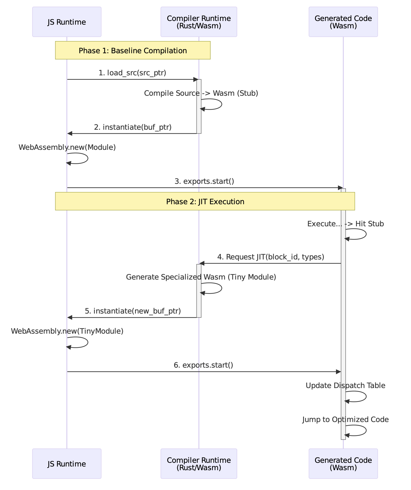
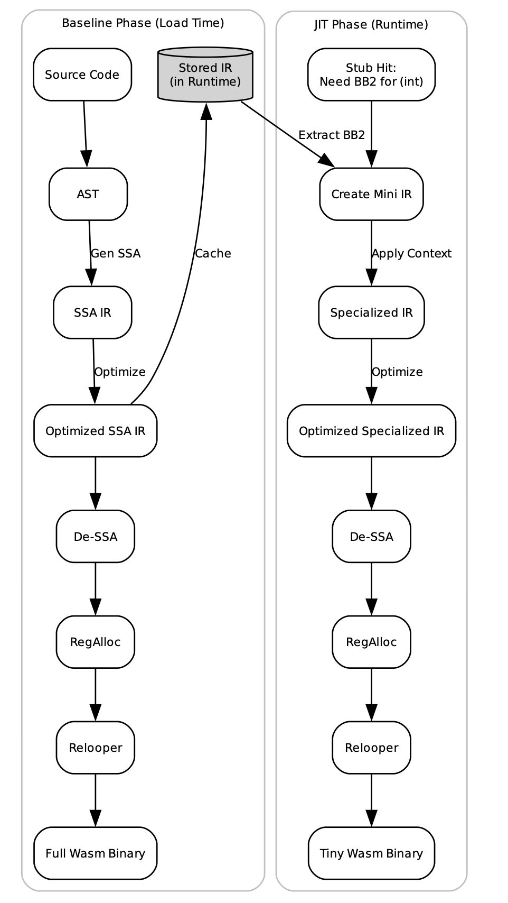

## はじめに
修論のためにWebAssembly向けのScheme JITコンパイラを実装したので、それについての解説記事です。

## 各種リンク
* [kgtkr/webschembly (23c80dd)](https://github.com/kgtkr/webschembly/commit/23c80dd8bf58b40468646dfa43189e722caccc3c)
* [Playground](https://kgtkr.github.io/webschembly/)
* [PPL 2026](https://jssst-ppl.org/workshop/2026/index.html)
  * 「WebAssemblyを対象とした基本ブロックバージョニング方式JITコンパイラ」というタイトルでポスター発表してきました
* [WebAssemblyに関数単位でJITする言語を実装した](2022/04/04/wasm-per-function-jit-language)
  * 4年前に書いた記事です。Wasmで動的なコード生成を行う小さな処理系を作ったことについての解説を行っています

修論はそのうち大学のリポジトリで公開されたらリンク追加します。

## 背景・モチベーション
C / Rustなどの静的型付け言語は、AOTコンパイラによってWasmに変換することで、Webブラウザ上で高速に実行することができるようになっています。
一方で動的型付け言語は、インタプリタをWasmにコンパイルして実行したり、AOTコンパイラによってWasmに変換して実行することが一般的であり、性能に限界があります。
そこで、Webブラウザ上で高速に動的言語を実行するために、Wasmを生成するSchemeのJIT処理系を実装しました。

## 基本方針
* R5RS準拠を目指す
  * 必要最低限の機能だけを実装してJITのほうに力を入れたのでかなりの機能が未実装…。継続以外で実装が無理な機能はなさそうだけど継続はどうしようという状況です
* Wasm GCを使う
* ランタイムの実装言語はRust / Wat / JS
* YJITなどで採用されているBasic Block Versioning (BBV)というJIT手法を使う

### Basic Block Versioning
BBVとは基本ブロックの入力変数の型によって基本ブロックを複製していくJIT手法です。
例えば以下のようなSchemeの関数を考え、この関数を整数引数で呼び出すことを考えます。

```
(define (sum-rec n m)
  (if (= n 0)
    m
    (sum-rec (- n 1) (+ m n))))
```

この関数の制御フローは以下のようになります。この時点では多くの型チェックが残っていることが分かると思います。



BBVでは「実際に実行されたBBのみを入力変数の型で特殊化して特殊化してコンパイルする」という戦略を取ります。
そのため初期状態では、基本ブロックは1つもコンパイルされておらず、到達するとコード生成を行い、生成コードを実行する「スタブ (Stub)」のみが存在します。ここでの `obj` とはBox化されたSchemeの値です。



スタブに到達すると次の条件分岐までコンパイルが進みます。
また条件分岐が型チェックの場合は、判明した型情報を次のスタブに渡します。



最終的には以下のようになります。
ここではBBだけでなく、引数の型に基づいてクロージャのエントリーも複製しています (他にもクロージャがキャプチャした変数の型によっても複製しています)。



こうすることで最も頻繁に実行される部分については、動的型チェックなしでループが回るようになります。

## WasmでBBV
BBVの実装には動的なコード生成と、生成コードに遷移するために任意アドレスへのジャンプが必要ですが、Wasm単体ではどちらも機能がありません。

### 動的なコード生成
動的なコード生成については過去記事でも解説したようにJSと組み合わせることで簡単に実装できます。これは以下のような関数をWasmにimportし、これをランタイムから呼び出すことにより可能です。

```
js_instantiate: (bufPtr, bufSize) => {
  const buf = new Uint8Array(
    runtimeInstance.exports.memory.buffer,
    bufPtr,
    bufSize,
  );

  const instance = new WebAssembly.Instance(
    new WebAssembly.Module(buf),
    importObject,
  );

  instance.exports.start();
}
```

### 生成コードへの遷移
BBVでは基本ブロック単位でコンパイルを行い、生成コードに遷移する方法が必要なので以下の方法をこれを実装します。

1. 基本ブロックをWasm関数として生成
   * BBの入力変数を引数として受け取るようなWasm関数を生成します。
2. 生成関数を含むWasmモジュールのエントリーポイントで、BBに対応する関数のfuncrefをグローバル変数にセットする
3. BBに遷移する側は対応するグローバル変数を読み出し、BBの入力変数を全て引数としてスタックに積み、末尾間接関数呼び出し命令 `return_call_ref` によって生成コードに遷移する

例えば以下のような処理を考えます。

```
;; [BB1] 条件分岐 (入力変数: $x, $y)
;; if (!x) { ... }
local.get $x
i32.eqz
if
  ;; [BB2] Then節 (入力変数: $y)
  ;; y = y + 1
  local.get $y
  i32.const 1
  i32.add
  local.set $y
end
;; [BB3] Merge地点 (入力変数: $y)
;; y = y * 2
local.get $y
i32.const 2
i32.mul
local.set $y

;; return y
local.get $y
return
```

これのBB1を生成する場合以下のようになります。

```
(func $bb1 (param $x i32) (param $y i32) (result i32)
  local.get $x
  i32.eqz
  if
    ;; BB2 (Then) へ遷移
    ;; 入力変数 y を引数として渡す
    local.get $y
    global.get $g_bb2
    ref.cast (ref null $i32_to_i32)
    return_call_ref (type $i32_to_i32)
  else
    ;; BB3 (Merge) へ遷移
    ;; 入力変数 y を引数として渡す
    local.get $y
    global.get $g_bb3
    ref.cast (ref null $i32_to_i32)
    return_call_ref (type $i32_to_i32)
  end
)
```

また、この時BB2の呼び出し元がまだ一度も生成されていない場合、`$g_bb2` をStubで初期化する必要があります。


```
(func $bb2_stub (param $y i32) (result i32)
  i32.const 2 ;; bb_id
  ;; その他特殊化に関する型情報なども渡す
  call $compile_bb ;; BBに対応するモジュールを生成し、インスタンス化するコンパイラの関数
  ;; $compile_bbを呼ぶとグローバル変数 $g_bb2 が $bb2_stub から $bb2 に置き換わるので呼び出す
  local.get $y
  global.get $g_bb2
  ref.cast (ref null $i32_to_i32)
  return_call_ref (type $i32_to_i32)
)
```

そしてこのモジュールのエントリーポイントでは `$g_bb1` を `$bb1` に、 `$g_bb2` を `bb2_stub` に設定します。

以下はJSランタイム、コンパイラランタイム、生成コード間の関係を示した図です。



## オーバーヘッド削減
前述の通り、今回の実装ではコンパイル単位間の遷移に末尾関数呼び出し命令を使っており、これはジャンプ命令と比較すると非常に遅いです。
この課題を解決するために「頻繁に実行される部分についてはコンパイル単位を拡大して再コンパイルする」という戦略を取っています。
これは以下の手順で行われます。

1. 最初は前述の通り分岐が出てくるまでをコンパイル単位とする。この際分岐の実行頻度を計測するプロファイリングコードを挿入する
2. 実行回数が一定回数を超え、分岐が偏っている場合は実行回数が多い方の分岐もコンパイル単位に含め、再コンパイルする。例えば前述の例だと `(= n 0)` の条件分岐は多くの場合 `false` 側に分岐するため、こちら側をコンパイル単位に含めて再コンパイルする。こうすることで頻繁に実行される経路については末尾関数呼び出し命令を削減することができ、パフォーマンス向上が期待できる。

これによってかなりオーバーヘッドの削減はできましたが、V8の2段階のJITコンパイラの影響で新たな問題も発生しました。
これは以下の順序で発生します。

1. 本処理系がTier1のWasmコードを生成し、V8のTier1コンパイラがそのWasmをネイティブコードにコンパイルする
2. 1のWasmの実行回数が増えるとV8のTier2コンパイラが高速なネイティブコードに変換する
3. その後、本システムがコンパイル単位を拡大したTier2のWasmコードを生成する。このコードはV8のTier1コンパイラでネイティブコードに変換される
4. さら更に実行が進むと、3のWasmをV8のTier2コンパイラが高速なネイティブコードに変換する

これによって多くの場合パフォーマンスは4>2>3>1となり、2から3に移行する段階で一時的にパフォーマンスが低下します。これはまだ解決できていない問題です。

## IRの話
本処理系では、SSAの独自IRを対象に最適化を行なっています。
Schemeコードを対象にクロージャ変換などを行い、Wasmに近い(が制御フローは構造的でない)IRを対象に最適化や、JITの状態管理を行うことで実装をシンプルに保っています。
また、以下のようにSchemeコード→IRに変換した後、JITなしで直接Wasmに変換することもでき、1つの実装でAOTコンパイラにもJITコンパイラにも対応できるようになっています。


